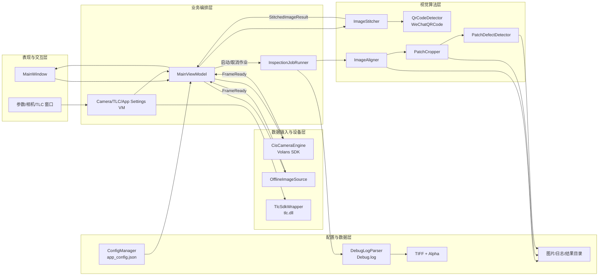
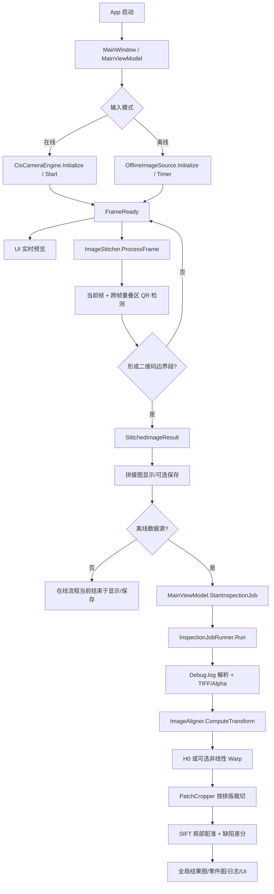
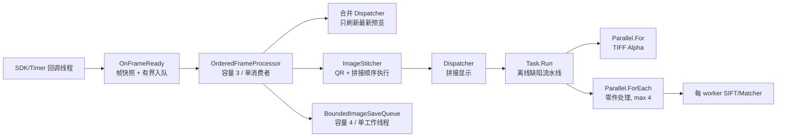

# CIS_WebInspector 项目深度分析报告

> 分析日期：2026-07-16  
> 分析范围：当前工作区正式源码、工程文件、配置、第三方依赖、运行日志、真实输入/输出图像，以及 `obj` 下现存验证探针  
> 目标平台：Windows x64 / .NET Framework 4.8 / WPF  
> 结论标识：**已确认事实**、**合理推断**、**无法确认**

---

## 0. 执行摘要

### 0.1 项目是什么

**已确认事实**：本项目是一套面向烫画膜/膜片类连续材料的 CIS 线扫机器视觉软件。软件通过在线采集卡或离线帧图库接收 CIS 图像，使用二维码确定完整排版段边界并完成跨帧拼接，再依据排版日志找到对应 TIFF 原图，完成全局几何对准、零件级二次配准和基于形态学差分的缺陷检测，最终在 WPF 界面显示并保存拼接图、零件裁图、缺陷图和全局结果图。

### 0.2 解决的实际问题

- CIS 相机输出的是连续小帧，而业务需要获得二维码之间的一张完整排版大图。
- 实拍图与 300 DPI TIFF 排版原图存在位置、尺度、旋转、扫描倾斜及局部误差，不能直接逐像素比较。
- 零件数量多，人工逐个核对效率低；项目把排版日志中的物理坐标转换为像素 ROI，自动裁切并判定断墨、漏印、飞墨、脏污等差异。
- 二维码还承担“段边界”和“排版数据索引”的双重作用，使图像、排版文件和检测结果能够关联。

### 0.3 当前完成度判断

- **离线闭环已形成**：图库输入 → 二维码识别 → 拼接 → 排版解析 → 对准 → 零件裁切 → 局部配准 → 缺陷检测 → UI/文件输出。
- **在线采集链路已接入**：Volans 采集卡、非托管缓冲池、回调和实时预览均有正式代码。
- **在线自动检测闭环尚未接通**：离线模式已通过 `StartInspectionJob → InspectionJobRunner.Run` 提交检测作业；在线模式当前完成采集、拼接、显示及可选保存，PLC 下发仅为注释占位。
- **算法效果已有真实运行样例，但无标注真值**：日志可证明流程运行和程序判定，不能证明缺陷准确率、召回率或误报率。

---

## 1. 项目背景、目标与业务价值

### 1.1 应用背景

连续膜片通过 CIS 沿 Y 方向逐行扫描，同一排版被分割为多帧。每个排版段由二维码标记，TIFF 原图提供设计真值与 Alpha 掩膜，设备后端日志提供二维码、TIFF 文件名和零件物理坐标。

### 1.2 项目目标

1. 稳定接收在线或离线 CIS 帧。
2. 在指定 ROI 内识别受拉伸、压缩和极性影响的二维码。
3. 在相邻帧重叠区正确处理跨帧二维码，输出二维码之间的完整大图。
4. 根据二维码从 `Debug.log` 获取对应排版和零件列表。
5. 把 CIS 大图变换到 TIFF 坐标系。
6. 按排版坐标裁切零件，进行局部二次对准和缺陷差分。
7. 形成可操作 UI、日志与可追溯输出文件。

### 1.3 业务价值

- 将连续采集数据转化为“按排版段、按零件”的可管理检测结果。
- 减少人工逐件比对，提高检测流程自动化程度。
- 通过二维码、排版日志、TIFF 与零件 ID 关联，为质量追溯提供数据基础。
- 传统视觉路线不依赖训练数据，便于快速上线和解释缺陷来源。

---

## 2. 分析方法与证据边界

### 2.1 实际检查内容

- 扫描根目录、解决方案、工程文件、正式源码、模型、原生 DLL、UI XAML、配置和日志。
- 从 `App.xaml` 追踪到 `MainWindow`、`MainViewModel`，再追踪在线/离线输入、拼接、全局对准、零件裁切、局部配准与缺陷输出。
- 检查 `Thread/Task/Parallel/lock/Dispatcher/ConcurrentDictionary`、`Mat/Bitmap/byte[]/IntPtr` 的生命周期。
- 读取真实输入帧、Mark 编号图、全局缺陷结果和零件缺陷图。
- 执行依赖还原检查、Debug/Release x64 构建、局部配准真实数据回归、左右 Mark 对准探针，并实际启动 x64 WPF 主界面。

### 2.2 证据分类

| 类别 | 定义 | 本报告示例 |
|---|---|---|
| 已确认事实 | 可由源码、配置、日志、图像或本次运行直接证明 | x64 构建 0 错误；离线流程触发缺陷检测；侧边非线性默认关闭 |
| 合理推断 | 调用关系和工业场景支持，但未在完整设备环境验证 | 在线同步处理可能对采集回调形成背压 |
| 无法确认 | 缺少硬件、驱动、授权、标注或生产节拍数据 | 在线持续采集稳定性；缺陷准确率/召回率；真实 PLC 联动 |

---

## 3. 项目目录与代码边界

```text
CIS_WebInspector/
├─ App.xaml / App.xaml.cs              # WPF 启动入口
├─ CIS_WebInspector.sln/.csproj         # 单工程解决方案、构建与依赖
├─ Views/                               # 主界面、系统参数、相机参数、TLC 参数
├─ ViewModels/                          # UI 状态、命令和主流程编排
├─ Models/                              # 配置、帧、排版、对准、检测结果模型
├─ Services/                            # 采集、二维码、拼接、对准、裁切、检测、日志解析
├─ Assets/WeChatQRCode/                 # WeChatQRCode 检测/超分模型及许可证
├─ TLC_SDK_C++_64位/                    # TLC 原生 SDK、头文件、DLL、控制台样例
├─ CIS缺陷验证/                         # Python/C++ 原型与样例帧，不是正式运行入口
├─ bin/                                 # 构建产物、配置、运行日志、真实输出图
├─ obj/                                 # 编译中间文件与若干硬编码验证探针
├─ logo.png                             # WPF 资源
└─ check.exe                            # 未在工程/源码中被引用，性质无法确认
```

### 3.1 正式核心模块

| 目录/文件 | 角色 | 是否进入正式主流程 |
|---|---|---|
| `ViewModels/MainViewModel.cs` | 采集会话、命令、UI 派发与检测结果发布 | 是 |
| `Services/InspectionJobRunner.cs` | UI 无关的离线检测作业编排：日志解析、TIFF、对准、裁切与检测 | 离线缺陷流程 |
| `Services/CisCameraEngine.cs` | Volans 在线采集与非托管缓冲池 | 在线模式 |
| `Services/OfflineImageSource.cs` | 图库计时读取和帧事件模拟 | 离线模式 |
| `Services/QrCodeDetector.cs` | WeChatQRCode 初始化、预处理与识别 | 是 |
| `Services/ImageStitcher.cs` | 二维码驱动的流式分段拼接 | 是 |
| `Services/ImageAligner.cs` | Mark 检测、H0、可选非线性网格与 Warp | 离线缺陷流程 |
| `Services/PatchCropper.cs` | 物理坐标转 ROI、并行裁切与汇总图 | 离线缺陷流程 |
| `Services/PatchDefectDetector.cs` | SIFT 二次配准、形态学差分与连通域判定 | 离线缺陷流程 |

### 3.2 辅助模块

- `ConfigManager`：从可执行目录加载/保存 `app_config.json`。
- `DebugLogParser`：把设备端日志映射为 `LayoutInfo/PartLocation`。
- `TlcSdkWrapper`、`TlcSettingsViewModel`：TLC 串口控制参数读写。
- `CameraSettingsViewModel`：枚举并修改 Volans 相机属性。
- `AlignmentData.cs`：封装 H0、控制网格、质量状态、诊断和资源所有权。
- `InspectionJobResult.cs`：在算法服务与界面之间传递作业状态、汇总数据和全局结果图。

### 3.3 原型、测试与可能废弃内容

- `CIS缺陷验证/align_diff.py`、`localpeizhun.cpp`、`Global_Registration.cpp`、`readlog.cpp` 是算法原型/参考实现；正式 WPF 流程不直接调用它们。
- `TLC_SDK_C++_64位/ConsoleTest.cpp` 是 SDK 控制台样例，不是 WPF 入口。
- `obj/AlignmentProbe2`、`LocalAlignmentRegressionProbe` 等是本地验证探针，未加入解决方案，也依赖硬编码外部路径。
- `obj/LocalAlignmentProbe` 引用了当前配置中不存在的旧参数，属于过时探针。
- `check.exe` 无工程引用和调用证据，不能作为正式功能介绍。
- 根目录没有 README，也没有正式测试工程。

---

## 4. 整体系统架构



### 4.1 架构类型

整体是“WPF MVVM 风格 + 服务类算法流水线”的单体桌面应用。检测作业已从 `MainViewModel` 下沉到 UI 无关的 `InspectionJobRunner`；ViewModel 仍负责采集会话、命令、线程切换和结果发布，是会话协调中心，但已不再直接持有 TIFF/Mat 和缺陷算法步骤。

### 4.2 优点

- 设备源统一实现 `ICameraSource`，在线/离线可替换。
- 视觉算法拆成二维码、拼接、全局对准、裁切、零件检测等服务，便于单模块验证。
- `AlignmentResult` 实现 `IDisposable`，对准矩阵、控制网格和诊断数据的所有权较明确。
- 配置覆盖采集、拼接、Mark、缺陷和保存开关，便于现场调参。

### 4.3 不足

- 检测作业已独立封装并支持取消、结果对象回传，但在线/离线尚未统一为完整作业状态机。
- 在线和离线结束后的处理逻辑不一致，自动检测闭环仅离线可用。
- 同步文件日志仍由 `MainViewModel.AddLog` 承担；采集会话、结果发布和日志尚可继续拆分。
- 结果只以图片和文本日志保存，没有结构化结果仓库或稳定外部接口。

---

## 5. 程序入口与初始化

### 5.1 真实入口

1. `App.xaml:4`：`StartupUri="Views/MainWindow.xaml"`。
2. `Views/MainWindow.xaml.cs:13`：构造 `MainViewModel` 并设置 `DataContext`。
3. `MainViewModel` 构造阶段加载全局配置，创建 `ImageStitcher`，绑定命令与日志。
4. 用户选择“加载配置”或“离线加载”后，才初始化具体数据源。

### 5.2 初始化依赖

- 在线：选择 `.arcf`，`CisCameraEngine.Initialize` 枚举并打开 Volans 设备，读取图像尺寸并创建非托管缓冲。
- 离线：选择文件夹，`OfflineImageSource.Initialize` 按文件名排序支持的图片。
- 开始采集前：初始化并预热 WeChatQRCode 模型，重置拼接状态，订阅帧和拼接事件。
- `ConfigManager` 的配置文件位于可执行目录；不存在时使用 `AppConfig` 默认值。

---

## 6. 完整运行流程与关键调用链

### 6.1 端到端流程



### 6.2 关键调用链

| 阶段 | 上游 → 下游 | 输入 | 输出 |
|---|---|---|---|
| 启动 | `App.xaml` → `MainWindow()` → `MainViewModel` | 应用进程 | UI 与命令 |
| 数据源 | `ExecuteLoadConfig/ExecuteLoadOffline` → `Initialize` | `.arcf` 或目录 | `ICameraSource` |
| 帧到达 | `FrameReady` → `MainViewModel.OnFrameReady` | `IntPtr/byte[]`、尺寸、stride | 预览 + 拼接输入 |
| 二维码/拼接 | `ImageStitcher.ProcessFrame` → `QrCodeDetector.Detect` | 当前帧、上帧尾部 | 二维码、段边界、拼接大图 |
| 拼接完成 | `EmitSegment` → `OnStitchCompleted` | 分块字节数组 | `StitchedImageResult` |
| 作业提交 | `StartInspectionJob` → `InspectionJobRunner.Run` | `StitchedImageResult`、配置、取消令牌 | `InspectionJobResult` |
| 排版定位 | `InspectionJobRunner.Run` → `ParseForQrCode` | 结束二维码、Debug.log | TIFF 路径、零件物理坐标 |
| 全局对准 | `ComputeTransform` → `WarpToTiffSpace` | CIS、TIFF、二维码几何 | `AlignmentResult`、CIS@TIFF |
| 零件处理 | `PatchCropper.CropAndSave` → `PatchDefectDetector.Detect` | 对准图、Alpha、零件列表 | `PatchDefectResult[]` |
| 显示与保存 | `InspectionJobRunner` → `InspectionJobResult` → `MainViewModel` | 检测列表、JPG 字节 | UI 图像、日志、目录 |

### 6.3 在线/离线差异

**已确认事实**：`MainViewModel.OnStitchCompleted` 只对 `OfflineImageSource` 执行停止、提示和 `StartInspectionJob`；算法步骤由 UI 无关的 `InspectionJobRunner.Run` 执行。在线模式仍没有提交检测作业，也没有 PLC 下发实现。

---

## 7. 数据流与坐标体系

### 7.1 数据流

```mermaid
flowchart LR
  F[FrameReadyEventArgs\nIntPtr/byte[]] --> S[ImageStitcher\n分块 byte[]]
  S --> SR[StitchedImageResult\n大图 + QR 几何]
  DL[Debug.log] --> LI[LayoutInfo\nPartLocation:mm]
  TF[TIFF BGRA] --> AM[Alpha Mask]
  TF --> TB[白底 BGR]
  SR --> CA[CisQrAnchor]
  CA --> AR[AlignmentResult\nH0/网格/质量]
  LI --> ROI[Rect:px]
  AR --> CW[CIS warped to TIFF]
  CW --> ROI
  AM --> ROI
  ROI --> DR[PatchDefectResult]
  DR --> UI[UI/图片/日志]
```

### 7.2 坐标体系

- CIS 帧坐标：单帧像素坐标，Y 沿扫描方向。
- 拼接全局坐标：`_globalProcessedRows + 帧内 Y`；`StitchedImageResult` 还记录段起始全局 Y。
- TIFF 像素坐标：`pxPerMm = LayoutDpi / 25.4`，当前配置为 300 DPI。
- 排版物理坐标：`PartLocation` 保存 mm，裁切时叠加 `LayoutOriginXmm/Ymm` 后乘 `pxPerMm`。
- CIS 比例：二维码物理宽高均按 60 mm，分别由 `PixelWidth/60`、`PixelHeight/60` 得到 X/Y 像素每毫米。
- 对准矩阵：`AlignmentResult.GlobalTransform` 为 CIS→TIFF 的 3×3 Homography；非线性模式使用逆映射残差网格。

---

## 8. 核心算法一：WeChatQRCode 二维码检测

### 8.1 解决问题与代码位置

- 问题：在固定横向 ROI 中识别被纵向拉伸/压缩、黑白极性反转或跨帧截断的二维码。
- 代码：`Services/QrCodeDetector.cs`；入口 `Initialize()`、`Detect()`，核心 `DetectCore()`。
- 输入：8/24 bpp 帧、宽高、stride；输出：`QrDetectionResult`（文本、中心、像素宽高）。

### 8.2 实际处理步骤

1. 按 `BaseRoiX/BaseRoiWidth` 和 `DownscaleFactor` 取得横向 ROI。
2. 转为灰度；当前配置 `QrInvertPolarity=true`，把黑底白码转换为更常见极性。
3. 依次尝试 Y 缩放候选 `1.0、0.67、1.5`。
4. 在锁内调用 OpenCV `WeChatQRCode.DetectAndDecode`。
5. 从四角点计算中心及 X/Y 投影宽高，再映射回原比例坐标。
6. 模型在启动阶段预热，避免首次识别抖动。

### 8.3 关键参数

| 参数 | 当前 x64 配置 | 含义 |
|---|---:|---|
| `BaseRoiX` / `BaseRoiWidth` | 125 / 1500 px | 只扫描二维码横向区域 |
| `QrInvertPolarity` | true | 反转灰度极性 |
| `QrScaleYCandidates` | 1 / 0.67 / 1.5 | 补偿扫描方向压缩/拉伸 |
| 模型 | detect + sr Caffe | 检测与超分辨率模型，随程序部署 |

### 8.4 优点、局限与优化

- 优点：比纯几何解码器更适合反光、低清晰度和形变；模型本地部署；无 ZXing 回退造成的额外分支。
- 局限：识别在 `_decodeLock` 内串行；多个 Y 候选会增加耗时；四角点的轴向投影宽高对大旋转/透视不够稳健。
- 异常：模型缺失、ROI 越界、OpenCV 原生异常均返回未找到并记录信息。
- 建议：记录每个候选耗时和成功率，按设备批次动态排序；宽高改用四边长度的鲁棒统计；增加 ROI/比例参数校验。

---

## 9. 核心算法二：二维码驱动的流式分段拼接

### 9.1 代码位置与状态机

- 代码：`Services/ImageStitcher.cs`，核心 `ProcessFrame()`、`EmitSegment()`。
- 状态：扫描等待首二维码 → 收集段图像 → 遇到下一二维码输出完整段。
- 输入：连续帧；输出：`StitchedImageResult`。

### 9.2 实际过程

1. 每帧先复制为受控的连续 `byte[]`。
2. 在当前帧检测二维码。
3. 拼接“上一帧尾部 + 当前帧头部”的重叠区再次检测，补偿二维码跨帧。
4. 用二维码中心 Y 加 `BaseQrOffsetRows` 确定裁切边界。
5. 支持边界延迟到下一帧完成，避免裁切点超出当前帧。
6. 段数据以多个块保存，完成时一次性展平；同时保留结束二维码全局/局部坐标和像素尺寸。

### 9.3 技术价值

- 无需把无限长扫描卷材全部驻留内存，只保留上一帧尾部和当前段块。
- 二维码既定位段边界，又把拼接结果关联到排版数据。
- 当前配置：`BaseQrOffsetRows=450`、`BaseOverlapRows=950`、`DownscaleFactor=1`。

### 9.4 局限与风险

- 已于 2026-07-16 将 `ProcessFrame` 移出数据源回调：回调只提交有界帧快照，`OrderedFrameProcessor` 以单消费者保持二维码检测与拼接顺序。
- 在线处理队列在配置等待时间内持续饱和时会明确告警并安全停采；该策略避免静默丢帧，但仍需用真实硬件验证队列容量与采集节拍。
- 全局二维码去重阈值使用固定 1000 像素，未随缩放和物理比例配置化。
- 帧在数据源、主流程和拼接器之间存在多次复制，超大帧会增加带宽和 GC 压力。

---

## 10. 核心算法三：排版解析、TIFF 与 Alpha 预处理

### 10.1 排版解析

- `DebugLogParser.ParseForQrCode()` 搜索同时包含二维码和 `formattingFilename` 的日志行，解析 JSON 和零件段。
- 输出 `LayoutInfo`：TIFF 文件名、完整路径和 `PartLocation` 列表。
- 注意：变量和注释表达“最后匹配”，实现遇到第一条匹配即 `break`；日志存在重复二维码时可能选错排版记录。

### 10.2 TIFF 处理

- 使用 `ImReadModes.Unchanged` 保留 BGRA。
- Alpha 克隆为设计掩膜；彩色通道按 Alpha 合成到白底 BGR。
- 合成采用 unsafe 行指针 + `Parallel.For`，避免逐像素 P/Invoke。
- 若 TIFF 无 Alpha，记录警告并使用统一阈值检测，设计真值质量下降。

### 10.3 优化建议

- 按时间、二维码和 TIFF 文件存在性选取最后一条有效记录，并返回多匹配诊断。
- 对日志格式做版本化 schema，不再依赖字符串切片。
- TIFF/Alpha 可按文件缓存，避免同一排版重复解码。

---

## 11. 核心算法四：20 mm Mark 全局 H0 对准

### 11.1 问题、输入与输出

- 问题：把 CIS 拼接大图映射到 300 DPI TIFF 排版空间。
- 代码：`Services/ImageAligner.cs:76` `ComputeTransform()`；`1691` `WarpToTiffSpace()`。
- 输入：CIS `Mat`、TIFF `Mat`、`CisQrAnchor`、`MarkAlignmentOptions`。
- 输出：`AlignmentResult`（H0、逆矩阵、模式、质量、诊断、耗时）和建议 CIS 二值化阈值。

### 11.2 物理先验

- TIFF 上排圆心 Y = 50 mm；下排圆心 Y = 1000−30 = 970 mm。
- 上下 Mark 直径 = 20 mm；行间距 = 920 mm。
- CIS 下排基准 = 第二个二维码在本拼接段中的 Y：`GlobalCenterY − SegmentStartGlobalY`。
- `cisPxPerMmY = EndQrPixelHeight / 60`，上排 Y = 下排 Y − `920 × cisPxPerMmY`。

### 11.3 实际处理步骤

1. 基于物理坐标构建 TIFF/CIS 上下横向搜索条带，先使用初始余量，不足时扩展。
2. TIFF：相对白色的颜色距离、轮廓面积、圆度和直径筛选圆。
3. CIS：CLAHE、Gaussian、多阈值、轮廓几何与 Y 聚类检测大圆。
4. 按归一化 X 位置匹配两侧点，避免直接依赖不同图宽。
5. 匹配点足够时使用 `FindHomography + RANSAC(5 px)`。
6. Homography 失败时尝试 `EstimateAffine2D + RANSAC` 并嵌入 3×3。
7. 默认用 `WarpPerspective(Linear)` 一次变换到 TIFF 尺寸。

### 11.4 优点、局限与风险

- 优点：物理先验缩小搜索范围；RANSAC 能抑制少量误检；诊断输出完整。
- 局限：上下两排约束了全局投影模型，但不能描述中间局部热变形；X 最近邻匹配缺少更强的一一顺序约束。
- 风险：二维码宽高估计错误会直接影响搜索条带；Mark 阈值和圆度参数对不同材料反光敏感。
- 建议：增加点序一致性、重投影残差分布、圆直径物理一致性和失败样例归档。

---

## 12. 核心算法五：可选左右 9 对 4 mm Mark 非线性对准

### 12.1 当前定位

**已确认事实**：功能已实现，但源码和当前 `app_config.json` 均默认关闭。关闭时明确返回 `GlobalOnly`，只使用上下 20 mm Mark 的 H0；质量不合格时也会记录原因并降级，不静默失败。

### 12.2 控制网格与逆映射

- 左右各 9 个内部层，另加 50 mm、970 mm 两个零残差边界，共 11 层。
- X 方向为左、虚拟中心、右三列；中心列残差固定为零，使边缘修正向中心衰减。
- 每个检测点残差：`detectedCis − H0⁻¹(expectedTiff)`。
- 左—中、中—右两个半幅在相邻 Y 层内双线性插值。
- 以 256 目标行为条带临时生成 `mapX/mapY`，调用 `Cv2.Remap` 后复用缓冲，不生成整幅映射。

### 12.3 质量门控

- 每侧至少 7/9 个有效点；不允许连续缺失两个内部层。
- 孤立缺失点由同侧上下残差插值。
- 中值/MAD 和层间平滑性剔除异常；检查左右顺序、Y 顺序和局部 Jacobian，防止网格翻折。
- 探针确认：开关关闭返回 `GlobalOnly`；单缺点可插值；连续缺点降级；探针 `RESULT=OK`。

### 12.4 探针数据与边界

- 本次探针输出：建图约 208.1 ms，Remap 约 84.6 ms，临时映射峰值约 15.2 MB；进程工作集峰值约 1078.9 MB。
- 这些数据来自指定样例和验证探针，不代表生产节拍。
- 当前正式运行日志显示侧边功能关闭，不能以这些图片证明它优于 H0。

---

## 13. 核心算法六：零件裁切与 SIFT 二次局部配准

### 13.1 裁切

- `PatchCropper.CropAndSave()` 把排版 mm 坐标加原点偏移后乘 `LayoutDpi/25.4` 得到 TIFF 像素 ROI。
- CIS、TIFF 和 Alpha 在 Y 方向翻转，以兼容原 `readlog.cpp` 坐标方向。
- 跳过二维码任务，按零件 ID 输出 `tiff/cis/alpha/defect` 图片。

### 13.2 当前局部配准技术路径

**已确认事实**：当前保留原有效果路径，仅增加 worker 复用、模板特征缓存和资源释放优化：

1. 零件图按 `DefectDetectScale` 缩小，宽度不低于 `DefectMinScaledWidth`。
2. 使用 `SIFT(100)` 提取 TIFF Alpha/结构图和 CIS 灰度图特征。
3. BFMatcher L2 做 KNN，Lowe ratio = 0.6。
4. 至少 4 个好匹配；先用 Fundamental Matrix RANSAC 过滤外点。
5. 对剩余点使用 `EstimateAffine2D`。
6. 仅当 `sx/sy∈(0.9,1.1)` 且 `dx/dy∈(-10,10)` 时应用。
7. 使用 Cubic Warp 得到局部对齐图，再进入差分检测。

### 13.3 性能实现

- `Parallel.ForEach<PartLocation, PatchSiftWorker>`：每个 worker 独占非线程安全 SIFT/Matcher。
- `PatchSiftTemplateCache` 已改为“16×16 二维网格签名快速分桶 + OpenCV L1 像素级精确确认”；签名碰撞不会复用错误特征，同时避免每次 `Mat.GetArray + SHA-256` 的整图托管复制。
- `DefectMaxParallelism=0` 时沿用自动策略 `min(4, CPU数)`；可显式配置 1–16，且不会超过逻辑处理器数。
- 每个真实批次输出总耗时、零件耗时 P50/P95/最大值、缓存命中/建模/精确比较、建键/比较耗时和托管/私有内存变化；批次目录保存 `PerformanceBaseline.csv`，上级裁切目录累计 `PerformanceBaselines.csv`。
- 历史真实回归：9 个零件全部处理，模板缓存 2 个，并行度 4，局部配准/缺陷阶段 1837 ms，`RESULT=PASS`。该数据来自优化前日志，只作为旧基线，不能当作新实现提速结论。

### 13.4 局限与建议

- Fundamental Matrix 对同平面小图不是最直接模型，但当前图像效果经用户验证较稳定；不应无证据更换。
- 当前矩阵门控只看对角尺度和平移，没有明确限制镜像、剪切、旋转及重投影误差。
- 已消除完整 Mat 的 SHA-256 和托管数组复制；精确命中仍需原生全图比较，其成本已单独计时，便于判断低命中批次是否值得缓存。
- 建议保持输出不变，使用累计基线依次验证自动、2、4、8 等并行度；比较总耗时、P95、缓存命中率与内存变化后再确定现场默认值。

---

## 14. 核心算法七：形态学差分缺陷检测

### 14.1 目标和代码

- 代码：`Services/PatchDefectDetector.cs:145` `Detect()`。
- 输入：TIFF Alpha、局部对齐后的 CIS、小图阈值与配置。
- 输出：`PatchDefectResult`，包括 Pass/Fail、内外缺陷数量、最大面积、矩形和全局 ROI。

### 14.2 实际检测逻辑

1. Alpha 以阈值 60 二值化；CIS 使用全局 Mark 推导阈值 + 偏移 10。
2. `dilate(CIS)` 后计算 `Alpha − dilatedCIS`，得到设计内部缺失：断墨、漏印候选。
3. `dilate(Alpha)` 后计算 `CIS − dilatedAlpha`，得到设计外部多余：飞墨、脏污候选。
4. 构建内外轮廓边缘排除带，抑制轻微配准误差产生的边界差分。
5. 连通域统计面积和外接矩形；阈值按缩放面积同步换算。
6. 最大内/外缺陷面积未超过阈值则 Pass，并生成三联可视化。

### 14.3 关键参数

| 参数 | 当前值 | 作用 |
|---|---:|---|
| `DefectDetectScale` | 0.3 | 降低计算量 |
| `DefectAlphaBinaryThresh` | 60 | 设计掩膜阈值 |
| `DefectCisThreshOffset` | 10 | CIS 阈值相对 Mark 最优值偏移 |
| `DefectAreaThreshInner/Outer` | 100 / 144 | 内外缺陷面积阈值 |
| `DefectToleranceInner/Outer` | 6 / 12 | 形态学容差 |
| `EdgeExclusionThick/Small` | 6 / 6 | 边缘抑制带 |

### 14.4 优点与局限

- 优点：流程可解释、无需训练样本；内缺失和外多余分开统计；可视化直接。
- 局限：对局部亮度、材料纹理、反光和对准误差敏感；面积阈值的业务单位仍是缩放像素；不具备缺陷类别学习能力。
- **项目中未提供实测准确率、召回率、误报率或缺陷尺寸标定数据。**

---

## 15. 关键数据结构

| 数据结构 | 核心字段 | 生产者 → 消费者 |
|---|---|---|
| `FrameReadyEventArgs` | `IntPtr/byte[]`、BufferIndex、Broken、Width/Height/Stride/Bpp | 数据源 → `MainViewModel` |
| `QrDetectionResult` | Found、Center、PixelWidth/Height、Text | `QrCodeDetector` → `ImageStitcher` |
| `StitchedImageResult` | 大图 byte[]、尺寸、起止 QR、段起点、结束 QR 几何 | `ImageStitcher` → 主流程/对准 |
| `LayoutInfo` | TIFF 文件名/路径、`PartLocation[]` | `DebugLogParser` → 缺陷流水线 |
| `PartLocation` | 任务 ID、mm 边界 | 日志解析 → `PatchCropper` |
| `CisQrAnchor` | CenterX、GlobalY、SegmentStart、PixelWidth/Height | 拼接结果 → `ImageAligner` |
| `AlignmentResult` | H0/H0Inv、模式、质量、控制网格、诊断、耗时 | `ImageAligner` → Warp/日志 |
| `PatchDefectResult` | IsPass、缺陷面积/数量/矩形、GlobalRoi | 检测器 → 汇总/UI/日志 |

### 15.1 表示形式与转换成本

- OpenCV 图像主要使用 `Mat`；WPF 显示使用 `WriteableBitmap/BitmapImage`；设备/拼接传输使用 `IntPtr` 与 `byte[]`。
- 典型链路包含：设备缓冲 → 缩放 Mat → 托管 byte[] → 拼接器再次复制 → 分块/展平 → 固定 byte[] → Clone 为 Mat → 编码/Bitmap。大图下内存带宽明显。
- `Mat` 多数使用 `using/finally` 释放；在线非托管缓冲由 `CisCameraEngine.Dispose` 释放，但初始化中途失败时需重点审计。
- `AlignmentResult` 显式 `IDisposable` 是较好的资源所有权设计。

---

## 16. UI、操作逻辑与输出

### 16.1 主界面

- 顶部：加载配置、离线加载、开始/恢复/停止、采集卡设置、相机设置、参数设置。
- 左侧：实时采集预览；右侧：拼接结果与全局缺陷图页签。
- 底部：实时日志、总帧数、丢帧数、缓冲索引和状态。
- 全局缺陷图支持缩放和平移，逻辑位于主窗口 code-behind。

### 16.2 参数界面

- 五个页签：基础与目录、拼接与排版、标志点配准、缺陷检测、图像保存。
- 侧边非线性和局部 SIFT 都有开关；多数参数以文本框直接解析，缺少范围验证和参数联动提示。
- `QrInvertPolarity`、`QrScaleYCandidates`、`MarkQrPhysicalWidthMm` 等重要参数未在现有设置界面完整暴露。

### 16.3 输出

- 单帧和拼接 JPG：可选自动保存。
- 零件：`*_tiff.jpg`、`*_cis.jpg`、`*_alpha.png`、`*_defect.jpg`。
- 全局：`GlobalDefectResult.jpg`，同时编码为内存字节显示在 UI。
- 日志：可执行目录下按日期写 `日志/SysRunLog_yyyyMMdd.txt`。
- 配置：可执行目录 `app_config.json`。

---

## 17. 多线程、异步、资源与性能分析

### 17.1 当前线程模型



### 17.2 正向设计

- WPF 图像更新通过 Dispatcher，避免直接从后台线程写 `WriteableBitmap`。
- 实时预览采用最新帧合并刷新，避免 Dispatcher 消息随采集帧无界堆积。
- 二维码/拼接采用有界单消费者队列，保持帧序；在线队列饱和时明确停采，不静默丢帧。
- 自动保存采用有界单工作线程队列，并复用输入帧数组，取消了每帧整图复制和逐帧 `Task.Run`。
- 有明确所有权的帧队列通过 `ImageStitcher.ProcessOwnedFrame` 直接读取托管缓冲区；拼接器只复制需要跨帧保存的 chunk/tail，移除了入口处第二次整帧复制。
- TIFF Alpha 合成按行并行，零件检测按零件并行。
- SIFT/Matcher 不跨 worker 共享，降低 OpenCV 非线程安全风险。
- 大量临时 `Mat`、描述子、匹配结果和矩阵使用 `using/finally` 释放。

### 17.3 主要性能瓶颈候选

1. 在线数据源回调仍同步完成 OpenCV 缩放和托管数组复制；二维码与拼接已移出回调，但前置缩放/复制仍需实测吞吐。
2. 自动保存队列已受容量限制；磁盘持续过慢时会明确跳过诊断单帧，需结合现场追溯要求决定是否改为停采或无损落盘。
3. `AddLog` 每条同步 `File.AppendAllText`，且二维码/帧日志较密集，会形成 IO 热点。
4. 零件并行度已可配置且能形成批次基线，但现场最佳值尚未通过同一数据、同一构建、重复运行确定。
5. 模板缓存已移除 SHA-256；当模板快速键相同但内容不同时仍需原生精确比较，低命中率批次的收益需依据 `CacheCompareMs` 判断。
6. 全局结果可视化、编码和部分 `Mat ↔ byte[] ↔ Bitmap` 转换仍会形成大图内存峰值。

### 17.4 线程与稳定性风险

- `FrameCount/BrokenCount/BufferIndex` 已由合并 Dispatcher 更新；仍需验证高帧率下 UI 刷新节奏。
- 全局可变 `ConfigManager.Config` 被多个线程读取，没有不可变快照。
- 帧队列与保存队列已有明确停止生命周期；离线检测作业已支持取消令牌和过期结果抑制，但 `PatchCropper` 内部尚未贯通细粒度取消。
- `TlcSettingsViewModel` 多个操作为 `async void`，窗口关闭时无法可靠等待和取消。
- 2026-07-16 复测使用 12 对真实零件，在 Debug/Release 20 轮及 4/9/24 并发压力下累计完成 603 次检测，三个进程均以退出码 0 结束，本轮未复现此前的非托管异常。
- 单进程 20 轮后的私有内存仍增加约 19.4–20.2 MB；这可能包含 JIT/OpenCV 高水位，现有轮次不足以证明持续泄漏，也不能替代 24 小时硬件长稳。

### 17.5 已测性能证据

| 场景 | 已确认结果 | 限制 |
|---|---|---|
| x64 Debug/Release 构建 | 均 0 警告、0 错误 | 仅当前开发机 |
| 真实局部回归 | 9 个零件，缓存 2，max并行4，1837 ms，PASS | 非生产节拍，不含完整采集 |
| 左右 Mark 探针 | Map 208.1 ms，Remap 84.6 ms，临时映射峰值 15.2 MB | 指定样例，工作集含整套图像 |
| 2026-07-16 日志 | H0 Mark 检测 299.0–945.8 ms；全局 Warp 47.1–59.0 ms | 5 次样例；侧边非线性关闭 |
| 模板缓存回归 | 6 张真实 Alpha：2 个唯一模板、4 次命中、2 次建模、4 次精确比较；网格签名累计约 1.03 ms；性能 CSV 结构检查通过 | 指定样例与单次探针，验证缓存等价性和观测链路，不代表端到端提速比例 |
| 原生稳定性复测 | Debug/Release 各 20 轮、240 次；并发探针 4/9/24 各 3 轮；累计 603 次检测均正常退出，未复现原生异常 | 12 对固定小图；私有内存 +19.4/+20.2 MB；不是 24h 硬件长稳 |

---

## 18. 第三方依赖与部署要求

| 名称/版本 | 用途 | 核心依赖 | 部署/兼容风险 |
|---|---|---|---|
| .NET Framework 4.8 + WPF | 桌面 UI 与运行时 | 是 | 仅 Windows；目标机需 .NET 4.8 |
| OpenCvSharp4 4.10.0.20241108 | Mat、特征、几何、形态学、WeChatQRCode | 是 | 需匹配 x64 `OpenCvSharpExtern.dll` 与 VC 运行库 |
| OpenCvSharp runtime.win | OpenCV 原生运行时、FFmpeg | 是 | 输出含约 61.7 MB Extern 和约 26.4 MB FFmpeg |
| System.Text.Json 10.0.9 | 配置与日志 JSON | 是 | 在 net48 上引入多项兼容依赖，需关注绑定重定向 |
| WeChatQRCode Caffe 模型 | 二维码检测/超分 | 是 | 四个模型文件必须复制到输出目录 |
| VolansGrabberCL_net/VolansGrabberCL | CIS 采集 SDK | 在线核心 | 版本信息不透明；依赖采集卡驱动、x64 DLL 和硬件 |
| CamExpRemote.dll | 相机/曝光相关原生依赖 | 在线 | 需与设备 SDK 版本匹配 |
| tlc.dll | TLC 串口/控制器参数 | TLC 设置 | 需硬件、端口、DLL；授权/固件兼容未验证 |

### 18.1 未发现的依赖

正式主流程未发现 ONNX Runtime、YOLO、CUDA、cuDNN、HALCON、数据库、网络服务、PLC SDK 或机器人 SDK。PLC 仅有注释占位，不能作为已实现集成。

---

## 19. 编译、运行与静态验证结果

| 验证项 | 结果 | 证据分类 |
|---|---|---|
| `dotnet restore` | 所有项目最新，成功 | 已确认事实 |
| Debug x64 build | 0 警告、0 错误，输出 `bin/x64/Debug/net48` | 已确认事实 |
| Release x64 build | 0 警告、0 错误，输出 `bin/x64/Release/net48` | 已确认事实 |
| WPF 启动 | x64 主窗口实际打开，标题和布局正常 | 已确认事实 |
| 真实图库局部回归 | 识别二维码、解析 11 项排版、处理 9 个有效零件，PASS | 已确认事实 |
| 左右 Mark 对准探针 | 开关、插值、降级、Remap 场景 `RESULT=OK` | 已确认事实 |
| 在线采集 | 未连接真实 CIS/采集卡 | 无法确认 |
| TLC 参数读写 | 未连接 TLC 硬件/串口 | 无法确认 |
| 缺陷准确率 | 无正常/缺陷标注真值 | 无法确认 |
| 原生稳定性复测 | 603 次检测、Debug/Release/并发进程退出码均为 0 | 已确认事实；此前异常本轮未复现 |
| 长时间内存稳定性 | 20 轮私有内存变化 +19.4/+20.2 MB，未执行 24h 硬件长稳 | 无法确认 |

### 19.1 路径与环境依赖

- `AppConfig` 默认包含开发机绝对路径；当前 x64 配置也指向 `E:\南京爱速智\CIS\moreMarks`。
- 本地探针硬编码外部数据路径，换机不可直接运行。
- 配置和输出默认写可执行目录；若安装到 `Program Files`，可能没有写权限。
- Vendor DLL 缺少可读取的版本元数据，部署清单需人工固化文件版本/哈希。

---

## 20. 项目实现效果

### 20.1 已实现功能

- 在线/离线帧输入、实时预览、帧计数和状态显示。
- WeChatQRCode 识别、跨帧重叠检测和二维码段拼接。
- Debug.log 排版映射、TIFF/Alpha 加载。
- 20 mm Mark H0 全局对准；可选左右 4 mm Mark 非线性校正。
- 排版坐标裁切、SIFT 局部二次配准、形态学缺陷检测。
- 零件/全局可视化、图片保存、参数配置和运行日志。

### 20.2 真实结果证据

- 日志中产生过 `7803×11200`、`7803×11226`、`7803×12714` 等拼接段。
- 2026-07-16 `10:43:03` 样例：12 个零件均被程序判为合格，结果目录含 12 组 `alpha/cis/tiff/defect` 和一张全局图。
- 同日日志另一批 6 个零件中程序判定 1 个不合格，记录 6 个内部、34 个外部候选。
- Mark 编号图、H0 Warp 图、零件三联差分图和全局结果图均存在真实文件。

### 20.3 不可夸大的指标

- 上述 Pass/Fail 是程序输出，不是人工标注真值。
- 项目中未提供准确率、召回率、误报率、测量精度、长期丢帧率、稳定运行时长或生产 takt 数据。
- 当前可确认“流程可运行并产生结果”，不能确认“达到量产验收精度”。

---

## 21. 真正可汇报的技术亮点

1. **二维码驱动的流式拼接**：在当前帧和跨帧重叠区双路检测，把连续扫描转为可追溯排版段。
2. **物理先验驱动全局对准**：用二维码像素尺寸换算 CIS 比例，用 20 mm Mark 和 300 DPI TIFF 建立可解释 H0。
3. **全局 + 局部两级配准**：H0 解决大图粗对准，零件 SIFT/仿射处理局部残余误差。
4. **设计 Alpha 与实拍差分**：把内缺失和外多余分别建模，并用边缘排除带降低对准误差影响。
5. **可选边缘非线性校正与明确降级**：三列十一层残差网格，验证失败时回退 GlobalOnly 并输出原因。
6. **多源输入和设备集成基础**：在线 Volans 与离线图库共用 `ICameraSource`，TLC 通过原生 SDK 封装。
7. **诊断与可视化较完整**：Mark、残差、控制网格、零件和全局结果均可生成图像和日志。

---

## 22. 当前问题、风险与分级优化建议

### 22.1 高优先级

| 当前问题 | 可能影响 | 建议方案 | 涉及模块 | 预期收益 |
|---|---|---|---|---|
| 已部分治理：在线拼接后不触发检测作业 | 真实产线仍无法自动闭环 | `InspectionJobRunner` 已抽出；下一步让在线/离线统一提交，并增加设备状态与结果回调 | MainViewModel、采集、检测 | 形成真正自动检测闭环 |
| 已治理：采集回调同步执行 QR/拼接 | 原风险为回调阻塞、积压或丢帧 | 已实现容量 3 的 `OrderedFrameProcessor`，单消费者顺序处理；在线满队列告警并停采 | MainViewModel、ImageStitcher | 回调减负、帧序稳定、过载可见 |
| 已治理：无界 `Task.Run` 保存图片 | 原风险为内存峰值和磁盘拥塞 | 已实现容量 4 的 `BoundedImageSaveQueue`，单工作线程；诊断单帧满队列告警并跳过 | MainViewModel、输出服务 | 内存有界、线程数可控 |
| 缺少标注与验收基线 | 无法判断算法是否真正改善 | 建立正常/缺陷/边界样本库，记录零件级真值和像素级缺陷 | 测试、算法 | 能量化准确率和回归 |
| 已复测：此前原生异常未复现 | 仍不能排除长时间或硬件链路偶发崩溃 | 保留 dump；增加逐轮内存曲线；执行 2h→8h→24h 阶梯长稳，并固定 OpenCvSharp 原生版本 | PatchDefectDetector、测试 | 将一次性通过升级为可审计长稳结论 |

### 22.2 中优先级

| 当前问题 | 可能影响 | 建议方案 | 涉及模块 | 预期收益 |
|---|---|---|---|---|
| 已部分治理：`MainViewModel` 职责集中 | 采集会话与日志仍使界面层偏重 | 检测作业已迁入 `InspectionJobRunner`；继续抽离采集会话、结果发布和异步日志 | ViewModels/Services | 算法可脱离 UI 测试，后续改动边界更清晰 |
| 已治理：固定最大并行度 4 | 原风险为多核机器吞吐不足或配置不适配 | `DefectMaxParallelism` 支持自动或显式 1–16；每批记录 P50/P95、内存和缓存指标 | PatchCropper、AppConfig | 可用同一数据做可复核调优 |
| 已治理：全图 SHA-256 模板缓存 | 原风险为额外托管复制和哈希开销 | 改为 16×16 网格签名分桶+原生精确确认；记录建键和比较耗时 | PatchDefectDetector | 保留严格等价缓存，减少托管大对象压力 |
| 同步逐条文件日志 | 热路径 IO 阻塞 | 异步结构化日志队列，按级别采样帧日志 | MainViewModel/日志 | 降低抖动，便于追踪 |
| 配置无强校验 | 除零、越界、错误阈值 | DTO 验证、范围提示、联动约束、原子保存和备份 | AppConfig/UI | 降低现场误配置 |
| Debug.log 取第一条匹配 | 重复记录时映射错误 | 选择最后一个完整有效块，返回候选数量与时间 | DebugLogParser | 提高排版关联可靠性 |
| 局部仿射质量门控偏弱 | 错误仿射可能掩盖/制造差异 | 不改技术路径，增加镜像/剪切/旋转/重投影的只拒绝门控并做 A/B 回归 | PatchDefectDetector | 提升稳定性且保持效果 |
| 大图多次复制 | 高内存和 GC 压力 | 明确缓冲所有权、ArrayPool/MemoryPool、减少 Clone、分块编码 | 采集/拼接/UI | 降低内存峰值 |

### 22.3 低优先级

| 当前问题 | 可能影响 | 建议方案 | 涉及模块 | 预期收益 |
|---|---|---|---|---|
| 根目录无 README/部署文档 | 交接困难 | 补架构、部署、配置、故障码、样例流程 | 文档 | 降低维护成本 |
| 原型与正式代码混放 | 容易误把旧代码当生产功能 | 移到 `prototypes/`、`tests/`，加状态说明 | 目录结构 | 边界清晰 |
| Vendor DLL 版本不可追溯 | 部署差异难定位 | 建立 DLL 哈希/版本清单和打包脚本 | 构建部署 | 可复现部署 |
| 配置写可执行目录 | 安装权限风险 | 改为 ProgramData/用户配置目录，输出目录单独配置 | ConfigManager | 标准部署 |
| 参数界面信息密度高 | 现场用户难理解 | 基础/高级分层、单位和建议范围、预设方案 | Views/VM | 改善操作体验 |

### 22.4 推荐实施顺序

1. 先建立数据集、指标和自动回归，避免“视觉上更好/更差”成为唯一依据。
2. 基于已抽出的 `InspectionJobRunner` 打通在线/离线统一作业状态机，解决生产闭环。
3. 基于本次 603 次通过结果继续做 2h→8h→24h 阶梯长稳，确认约 20 MB 私有内存增量是否收敛。
4. 已完成并行度配置、模板缓存和拼接入口复制链路治理；下一步用累计 CSV 选择现场默认并行度。
5. 最后再评估侧边非线性和局部配准模型的算法升级。

---

## 23. 事实、推断与无法验证清单

### 23.1 已确认事实

- 单 WPF 工程，net48、x64、OpenCvSharp 4.10、WeChatQRCode 模型本地部署。
- 正式入口和离线完整调用链已追踪到具体类和方法。
- 当前二维码模块为 WeChatQRCode，没有 ZXing 失败回退。
- 侧边 9 对 Mark 非线性功能存在并默认关闭。
- 局部对准使用原 SIFT + Fundamental RANSAC + Affine 路线。
- 离线检测算法已从 `MainViewModel` 抽离到 UI 无关的 `InspectionJobRunner`，通过 `InspectionJobResult` 回传；在线模式尚未提交检测作业，PLC 下发未实现。
- x64 Debug/Release 构建通过，依赖还原通过，WPF 主界面可启动。
- 真实图库回归和对准探针通过；存在真实输入、对准、零件和全局输出图片。
- 原生稳定性复测使用 12 对真实 Alpha/CIS：Debug/Release 各完成 20 轮、240 次；4/9/24 并发各 3 轮；累计 603 次检测均正常退出，本轮未复现非托管异常。
- 采集回调已改为有界帧入队，QR/拼接由单消费者顺序执行；自动保存已改为有界单工作线程队列。
- 零件并行度已配置化；模板缓存已移除全图 SHA-256；拥有帧已移除拼接入口整帧复制；批次/累计性能 CSV 记录链路已验证。
- 本次职责拆分后的 x64 Debug/Release 构建通过，0 警告、0 错误。

### 23.2 合理推断

- 在有界队列治理后，剩余高帧率风险主要来自数据源内的缩放/复制和同步日志；真实吞吐取决于硬件帧率与磁盘速度。
- 自动并行度仍以 4 为安全上限；最佳显式值依赖内存带宽、OpenCV 内部线程和零件尺寸，应以 `PerformanceBaselines.csv` 的重复批次统计决定。
- 局部仿射若发生剪切/镜像，现有尺度和平移门控可能无法完全阻止。
- 侧边非线性模型适合边缘热变形，但是否优于 H0 取决于 Mark 检测误差和材料形变分布。

### 23.3 无法确认

- CIS 采集卡、相机、TLC 在真实硬件上的持续运行、丢帧率和故障恢复。
- PLC/机器人/网络/数据库联动，因为正式代码未实现。
- 缺陷准确率、召回率、误报率、最小可检缺陷尺寸和量产节拍。
- 侧边非线性相对 H0 的统计收益。
- 2h、8h、24h 长稳时私有内存是否最终收敛；本次 20 轮仍有 +19.4/+20.2 MB 增量。
- Vendor SDK 的精确版本、驱动要求、授权和目标机 VC 运行库状态。

---

## 24. PPT 逐页设计（20 页，15–20 分钟）

| 页 | 标题 | 核心内容 | 推荐图示/真实素材 | 来源 | 备注与时长 |
|---:|---|---|---|---|---|
| 1 | CIS 线扫膜片缺陷检测系统 | 项目定位、分析范围、日期 | 深蓝工业封面 + 扫描帧局部 | 工程、真实帧 | 30 秒，说明汇报边界 |
| 2 | 一页看懂项目 | 输入、核心链路、输出、当前完成度 | 输入→处理→输出三段图 | 主流程代码/日志 | 50 秒 |
| 3 | 业务问题与价值 | 连续帧、对准误差、逐件检测、追溯 | 原始帧 + 四个痛点 | 样例帧/业务流程 | 50 秒 |
| 4 | 代码版图与边界 | 正式、辅助、原型、输出 | 目录树与颜色分区 | 全目录扫描 | 40 秒 |
| 5 | 系统总体架构 | UI、编排、设备、视觉、数据 | 五层架构图 | 实际类/依赖 | 60 秒 |
| 6 | 两种输入模式 | 在线 Volans 与离线图库差异 | 双泳道流程 | 数据源实现 | 45 秒 |
| 7 | 完整执行流程 | 从启动到结果 | 端到端流程图 | MainViewModel 调用链 | 60 秒 |
| 8 | 数据与坐标如何流动 | 帧、拼接、排版、H0、ROI、结果 | 数据流 + 坐标关系 | Models/算法 | 55 秒 |
| 9 | WeChatQRCode 识别 | ROI、极性、Y 形变候选、跨帧 | 算法流程 + 参数卡 | QrCodeDetector/AppConfig | 55 秒 |
| 10 | 二维码驱动流式拼接 | 状态机、重叠区、分块输出 | 状态机/扫描带示意 | ImageStitcher | 55 秒 |
| 11 | 排版关联与 TIFF 预处理 | QR→日志→TIFF→Alpha | 关联链路 | DebugLogParser/MainVM | 45 秒 |
| 12 | 20 mm Mark 全局对准 | 物理先验、圆检测、RANSAC H0 | 坐标示意 + H0 公式 | ImageAligner/Mark图 | 60 秒 |
| 13 | 可选 9 对侧边 Mark | 三列十一层、残差、Remap、降级 | 真实编号图 + 控制网格 | AlignmentProbe2 | 55 秒 |
| 14 | 零件级 SIFT 二次配准 | ROI、SIFT、RANSAC、Affine | 局部配准管线 | PatchCropper/Detector | 60 秒 |
| 15 | 缺陷检测如何判定 | 内缺失、外多余、形态学、连通域 | 真实三联缺陷图 | defect.jpg/代码 | 55 秒 |
| 16 | 多线程、内存与性能 | 回调减负、有界队列、真实耗时、复制链 | 线程泳道 + 数据卡 | MainViewModel/队列服务/日志 | 60 秒 |
| 17 | 界面与操作流程 | 按钮、预览、结果、日志、设置 | 按实际界面重绘的 UI 结构图 | XAML/实际启动检查 | 45 秒 |
| 18 | 实际运行结果 | 拼接尺寸、12 件结果、真实全局图 | GlobalDefectResult + 数据卡 | 运行日志/输出图 | 55 秒 |
| 19 | 风险与优先级 | 在线闭环、已治理队列、原生异常、真值缺失 | 风险矩阵 + 治理状态 | 源码/验证 | 55 秒 |
| 20 | 优化路线与结论 | 基线→闭环治理中→稳定→性能→算法 | 四阶段路线图 | 综合分析 | 50 秒，总结 |

### 24.1 PPT 视觉规范

- 16:9；深蓝、石墨灰、白色，青蓝/绿色作算法与通过状态强调色。
- 页面标题 35–40 pt，正文 17–22 pt，封面标题 50 pt 以上。
- 每页 3–6 个核心信息；来源放页脚；详细代码位置、讲解逻辑和时间放演讲备注。
- 只使用项目真实图像或基于实际类名绘制的原生矢量图，不生成虚构检测结果。

---

## 25. 总结

项目已经具备一条有实际代码和样例输出支撑的离线工业视觉流水线：以二维码完成连续帧分段与排版关联，以 Mark/H0 完成全局坐标统一，以零件 SIFT 和形态学差分完成逐件检测。其最有价值的部分不是单一算法，而是“采集—拼接—排版—对准—裁切—检测—可视化”的端到端整合。

下一阶段不宜首先继续叠加复杂算法，而应优先完成三件事：建立带真值的回归数据集；让在线模式与缺陷作业形成有界、可取消、可追踪的闭环；将本次 603 次无崩溃复测扩展为带逐轮内存曲线的 2h→8h→24h 阶梯长稳。完成这些基础后，再以数据决定非线性对准、局部配准和缺陷模型是否升级。
