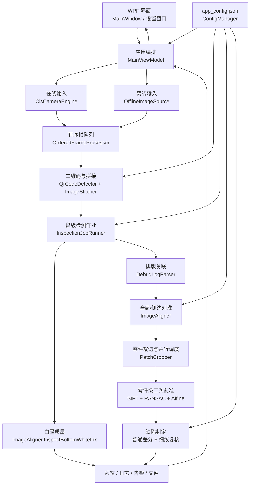
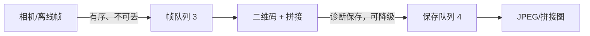
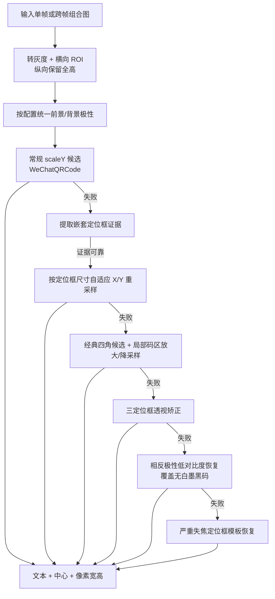
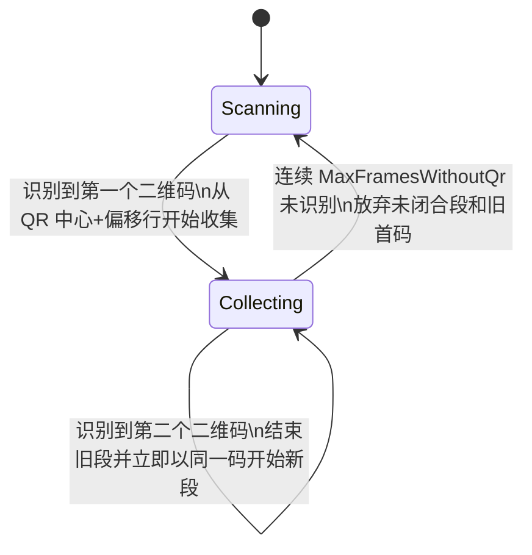
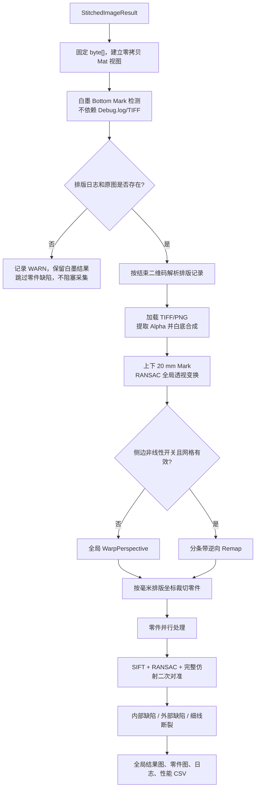
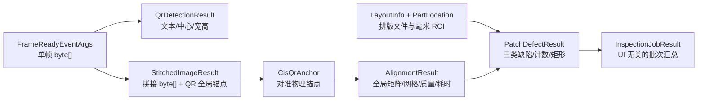
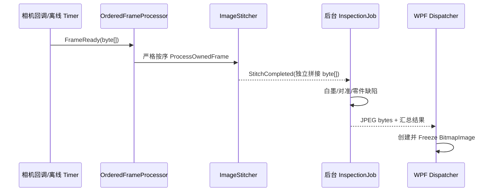

# CIS_WebInspector 项目全局导航与开发指南

> 文档定位：面向项目维护者的中文“导航 README”。重点回答三个问题：程序如何运行、模块如何协作、修改某项功能时应从哪里进入。  
> 核对基线：2026-08-13 当前工作区源码。  
> 构建验证：`Debug | x64 | .NET Framework 4.8` 已构建通过，0 个警告、0 个错误。  
> 注意：本文描述的是当前正式 C# 运行链路，不把 `CIS缺陷验证` 中的 Python/C++ 实验代码当成正式功能。

---

## 1. 一分钟认识项目

`CIS_WebInspector` 是一套用于连续膜片/印刷图案的 CIS 线扫视觉检测软件。它把 CIS 相机持续输出的单帧小图按二维码边界拼成一张产品大图，再结合上游排版日志和 TIFF/PNG 排版原图，完成：

1. 在线相机采集或离线图库回放；
2. 异常、变形、低对比度二维码识别；
3. 以相邻两个二维码为边界进行连续图像拼接；
4. 白墨墨量、无墨和拉丝状态检测；
5. CIS 大图到排版原图空间的 Mark 点全局对准；
6. 可选的左右侧边 Mark 非线性补偿；
7. 按排版坐标裁切每个零件；
8. 零件级 SIFT + RANSAC + 仿射二次对准；
9. 内部缺陷、外部缺陷和细线断裂三类缺陷检测；
10. 结果预览、图片保存、性能基线和运行日志输出。

业务上的核心价值是：把“连续采集的大幅膜片图像”转换为“可与设计排版逐件比较、可定位、可追溯的检测结果”。

---

## 2. 推荐阅读顺序

如果第一次接触项目，建议按下面顺序阅读代码：

1. [Models/AppConfig.cs](Models/AppConfig.cs)：先认识所有系统参数和物理假设；
2. [ViewModels/MainViewModel.cs](ViewModels/MainViewModel.cs)：理解应用主调度和在线/离线流程；
3. [Services/ImageStitcher.cs](Services/ImageStitcher.cs)：理解二维码如何决定拼接段；
4. [Services/InspectionJobRunner.cs](Services/InspectionJobRunner.cs)：理解拼接完成后的检测主线；
5. [Services/ImageAligner.cs](Services/ImageAligner.cs)：理解白墨、Mark 对准和图像变换；
6. [Services/PatchCropper.cs](Services/PatchCropper.cs)：理解排版坐标如何变成零件 ROI；
7. [Services/PatchDefectDetector.cs](Services/PatchDefectDetector.cs)：理解局部配准和缺陷判定；
8. [Services/QrCodeDetector.cs](Services/QrCodeDetector.cs)：最后深入二维码的多级恢复逻辑。

只想快速修改某项功能时，可直接跳到[第 14 节：按需求定位修改位置](#14-按需求定位修改位置)。

---

## 3. 技术栈与运行边界

| 项目 | 当前实现 | 用途 |
|---|---|---|
| 应用类型 | WPF 桌面程序 | 参数设置、采集控制、图像与日志展示 |
| 运行时 | .NET Framework 4.8，x64 | 工控机 Windows 环境 |
| 图像处理 | OpenCvSharp 4.10 | Mat、变换、形态学、SIFT、差分、连通域等 |
| 二维码 | OpenCV WeChatQRCode | CNN 检测、超分辨率和二维码解码 |
| 配置/排版解析 | System.Text.Json 10.0.9 | `app_config.json` 和 Debug.log 内嵌 JSON |
| 在线采集 | VolansGrabberCL SDK | CameraLink 采集卡与 CIS 帧回调 |
| 相机参数 | `tlc.dll` | 串口端口、行频、增益、灯光、FFC 等 |
| 原生平台 | x64 | OpenCV、采集卡和 TLC 原生 DLL 均要求位数一致 |

项目不包含深度学习缺陷模型、数据库、PLC/DCS 正式通信实现。WeChatQRCode 自带神经网络模型，但业务缺陷检测仍是传统视觉算法。

---

## 4. 目录结构与正式/辅助代码边界

```text
CIS_WebInspector/
├─ App.xaml / App.xaml.cs              # WPF 入口
├─ CIS_WebInspector.sln/.csproj         # 解决方案、依赖和原生 DLL 复制规则
├─ Assets/WeChatQRCode/                 # 二维码检测/超分辨率模型及许可
├─ Models/                              # 配置、帧、拼接、排版、对准、检测结果
├─ Services/                            # 采集、拼接、识别、对准、检测等核心服务
├─ ViewModels/                          # 主流程调度与设置页绑定
├─ Views/                               # 主窗口、参数设置、采集卡与相机设置界面
├─ TLC_SDK_C++_64位/                    # TLC 头文件、库、DLL 和厂商 C++ 示例
├─ CIS缺陷验证/                         # 独立算法验证材料，不进入正式 C# 调用链
├─ bin/、obj/                           # 构建和运行产物，不应作为源码修改入口
└─ outputs/                             # 汇报、方案等交付文档，不进入程序运行链
```

### 4.1 核心目录

- `Models`：跨模块传递的数据契约，以及所有可配置参数。
- `Services`：项目核心。包含输入、二维码、拼接、对准和缺陷检测。
- `ViewModels`：把 UI 操作连接到服务；`MainViewModel` 是当前应用编排中心。
- `Views`：只负责展示和少量窗口交互，不应放图像算法。

### 4.2 辅助或非正式运行内容

- `CIS缺陷验证/*.cpp`、`align_diff.py`：历史/实验参考，不被 `.csproj` 编译。
- `TLC_SDK_C++_64位/ConsoleTest.cpp`：厂商示例，不是 WPF 主程序入口。
- `bin`、`obj` 下的预览、日志、模型副本和探针输出：属于构建/运行产物。
- 当前没有独立单元测试工程；算法验证主要依赖离线图库、日志和结果图。

---

## 5. 整体架构



当前架构属于“WPF MVVM 外壳 + 服务式图像流水线”。算法类与 WPF 已有较清楚的边界：`InspectionJobRunner` 和主要视觉服务不创建 WPF 对象，UI 图像最终由 `MainViewModel` 在 Dispatcher 上发布。

主要耦合点是：

- `MainViewModel` 同时承担设备生命周期、队列、拼接事件、作业协调、日志和 UI 状态；
- 多个服务直接读取 `ConfigManager.Config`，不是完全依赖注入；
- `ImageAligner` 同时包含白墨检测、全局 Mark、侧边 Mark 和 Warp，职责较重；
- `PatchDefectDetector` 同时包含 SIFT、普通差分、细线连续性和可视化。

---

## 6. 程序入口与启动链

真实入口不是单独的 `Main()` 源文件，而是 WPF 构建生成的入口：

```text
App.xaml
  StartupUri = Views/MainWindow.xaml
      ↓
MainWindow 构造
  InitializeComponent()
  new MainViewModel()
  DataContext = MainViewModel
      ↓
用户选择“加载配置”或“离线加载”
      ↓
点击“开始采集”
  预加载/预热 WeChatQRCode
  创建有序帧消费者
  启动在线相机或离线定时回放
```

关键文件：

- [App.xaml](App.xaml)：声明 `Views/MainWindow.xaml` 为启动窗口；
- [Views/MainWindow.xaml.cs](Views/MainWindow.xaml.cs)：创建并释放 `MainViewModel`，另含图像缩放/拖动；
- [ViewModels/MainViewModel.cs](ViewModels/MainViewModel.cs)：应用主流程入口。

二维码模型采用延迟初始化：程序打开时不加载，开始采集前由 `ImageStitcher.InitializeQrDetector` 完成加载和 warm-up，避免首帧承担模型初始化耗时。

---

## 7. 在线与离线输入

### 7.1 统一接口

[Services/ICameraSource.cs](Services/ICameraSource.cs) 统一了两种来源：

- `FrameReady`：交付一帧独立、只读的 `byte[]`；
- `ErrorOccurred`：返回输入错误；
- `Initialize / StartGrab / StopGrab`：统一生命周期；
- `Width / Height / Stride / BitsPerPixel`：统一图像描述。

### 7.2 在线采集

[Services/CisCameraEngine.cs](Services/CisCameraEngine.cs) 的主要职责：

1. 枚举并打开 Volans 设备；
2. 加载 `.arcf` 采集卡配置；
3. 读取图像宽、高、格式和位深；
4. 分配 `BufferCount` 个非托管缓冲；
5. 注册 SDK 图像完成回调；
6. 在回调内缩小图像并复制到独立托管 `byte[]`；
7. 触发 `FrameReady`，随后由后台队列处理二维码和拼接。

原生 SDK 缓冲会被采集卡循环复用，因此不能把 SDK 指针或 `Mat` 直接交给异步流水线。当前实现会在回调内形成独立帧数组，这是线程安全和数据生命周期的关键边界。

### 7.3 离线回放

[Services/OfflineImageSource.cs](Services/OfflineImageSource.cs) 会：

- 读取 BMP/PNG/TIF/TIFF/JPG/JPEG；
- 按文件名不区分大小写排序；
- 每 10 ms 用 Timer 模拟一帧；
- 按 `DownscaleFactor` 使用 Area 缩小；
- 为每帧记录 `SourceFrameIndex`；
- 拼接完成或二维码超时暂停后，从“真正被算法消费的下一帧”恢复，而不是从可能已预读到的文件位置恢复。

离线与在线之后共用同一套二维码、拼接、白墨、对准和缺陷检测代码，因此离线图库是当前最重要的回归验证入口。

---

## 8. 帧队列、保存队列与背压

### 8.1 有序帧处理队列

[Services/OrderedFrameProcessor.cs](Services/OrderedFrameProcessor.cs) 是有界、单消费者队列，保证二维码检测和拼接严格按采集顺序执行。

- 默认容量：`FrameProcessingQueueCapacity = 3`；
- 在线入队等待：默认 50 ms；
- 离线入队：无限等待，不跳图；
- 在线队列持续满：安全停采并告警，不静默丢帧；
- 停止或离线断点时，可丢弃尚未开始处理的预取帧。

“容量为 3”表示最多允许 3 张尚未处理的帧排队，不是只处理 3 张，也不是相机缓存数量。

### 8.2 图像保存队列

[Services/BoundedImageSaveQueue.cs](Services/BoundedImageSaveQueue.cs) 用单消费者串行编码图片：

- 默认容量：`ImageSaveQueueCapacity = 4`；
- 保存请求复用原 `byte[]`，不再复制整图；
- 队列满时跳过本次诊断图保存，但检测主线继续；
- JPEG 默认质量 90。

“容量为 4”表示最多暂存 4 个待编码/落盘任务。它控制磁盘保存积压，不控制检测并行度。

### 8.3 为什么分成两个队列



帧队列保护业务正确性；保存队列隔离磁盘和 JPEG 编码波动。两者不能合并理解。

---

## 9. 二维码识别与拼接状态机

### 9.1 当前二维码整体逻辑

核心类：[Services/QrCodeDetector.cs](Services/QrCodeDetector.cs)，主入口 `Detect`，核心方法 `DetectCore`。

所有成功结果最终都必须由 WeChatQRCode 解出非空文本。几何检测、定位框、透视恢复和图像重采样只负责提供更适合解码的输入，不自行猜测二维码内容。



当前实现的关键约束：

- ROI 只限制 X，Y 使用整帧，能覆盖二维码在帧内任意纵向位置；
- `BaseRoiX/BaseRoiWidth` 按原始采集尺寸配置，检测时自动除以 `DownscaleFactor`；
- 核心 ROI 两侧增加约 1/6 宽度保护带，用于边缘码定位，但不会把整幅宽图都交给网络；
- 常规形变主要按线扫方向枚举 `scaleY`；
- 后续自适应 X/Y 缩放来自定位框几何，不依赖固定的历史样本缩放值；
- 低对比度反极性和严重模糊恢复均有定位框证据门控，避免每张无二维码图都重复跑重流程；
- `LastDecodeStrategy` 记录成功路径，`LastError` 记录模型/参数异常；“正常未识别到码”本身不算异常。

### 9.2 单帧和跨帧共用同一检测器

[Services/ImageStitcher.cs](Services/ImageStitcher.cs) 每帧依次执行：

1. 当前完整帧调用 `QrCodeDetector.Detect`；
2. 若未命中，把“上一帧底部 + 当前帧顶部”组成重叠图，再调用同一 `Detect`；
3. 因此非常规二维码不论出现在单帧还是跨帧，都走同一多级识别策略；
4. 如果二维码中心后的固定裁切行超出当前帧，会记录延迟裁切，在后续帧执行。

### 9.3 拼接状态机



第二个二维码既是当前段的结束边界，也是下一段的起始边界，连续材料之间不会产生空洞。

### 9.4 超时保护

当已找到首码，但连续 `MaxFramesWithoutQr` 帧仍没有第二个二维码时：

- 清除旧首码；
- 清除已累计的大图 chunk；
- 清除与旧段有关的延迟切割；
- 回到 `Scanning`；
- 下一次识别到的二维码作为新的第一个二维码。

这项保护防止旧首码长期有效，使最终拼接图高度和内存无限增长。

### 9.5 拼接输出

`StitchedImageResult` 不只包含像素，还保留：

- 起始/结束二维码文本；
- 当前拼接段在连续扫描中的全局起始 Y；
- 第二个二维码的全局 Y 和段内局部 Y；
- 第二个二维码的中心 X、像素宽和像素高。

这些几何数据会继续用于白墨 Bottom 区域定位和 CIS 的 X/Y 像素—毫米换算。

---

## 10. 拼接完成后的完整检测流水线

主入口：[Services/InspectionJobRunner.cs](Services/InspectionJobRunner.cs) 的 `Run`。



### 10.1 作业调度语义

在线和离线拼接完成后都会调用 `StartInspectionJob`：

- 离线模式立即暂停输入，保留下一帧检查点，等待用户恢复；
- 在线模式继续采集下一段；
- 检测作业在后台执行，不阻塞 UI；
- `_inspectionExecutionGate` 保证一次只运行一个大图检测作业；
- 当前采用“最新作业优先”：新拼接段到来时取消旧作业，过期结果不能覆盖新预览。

最后一点在持续在线生产中需要特别关注：如果新拼接段到达速度快于缺陷流水线，旧段可能被取消。若业务要求“每一段必须检测”，后续应将“最新作业优先”改成有界 FIFO 作业队列，而不是简单提高并行度。

### 10.2 外部排版数据缺失

白墨检测在排版解析前执行，所以在线工控机没有 Debug.log 或 TIFF/PNG 时：

- 白墨仍可检测、记录、生成预览和弹窗；
- 零件级对准/缺陷检测跳过；
- 日志记录 `[WARN]`；
- 采集程序继续运行，不抛出阻塞式异常。

---

## 11. 核心算法详解

### 11.1 白墨墨量与拉丝检测

入口：`ImageAligner.InspectBottomWhiteInk`。  
位置：[Services/ImageAligner.cs](Services/ImageAligner.cs)。

它只依赖拼接图、第二个二维码锚点和白墨配置，不依赖排版原图。

处理步骤：

1. 由第二个二维码全局 Y 定位底排 20 mm Mark 的中心行；
2. 常规轮廓检测不足时，在受限 Bottom 条带内使用物理半径约束的 Hough 圆后备；
3. 使用“同排圆心共线、直径一致”的设计规则修正低对比度圆心；
4. 在每个圆心内部采样 Mark 灰度，在圆外环采样邻近背景；
5. 多个 Mark 的均值、方差、背景和对比度取中位数，降低单点污渍/反光影响；
6. 用“背景 → 正常白墨基准”的有效对比度归一化出墨量；
7. 每 20% 分档：无墨、严重不足、中度不足、轻度不足、正常；
8. 圆内灰度标准差超过阈值时判为拉丝；
9. 生成 `WhiteInk_BottomMarks_Preview.jpg`，标注状态和 D1…Dn 圆。

当前白墨判断有意只保留两个主要标定量：

- `WhiteInkNormalGray`：正常白墨灰度基准；
- `WhiteInkStreakStdDevThreshold`：拉丝标准差阈值。

目的是避免现场阈值互相牵制。白墨结果是过程质量状态，不直接改变零件缺陷 Pass/Fail。

### 11.2 全局 Mark 对准

入口：`ImageAligner.ComputeTransform`。

全局基准来自上下两排 20 mm 圆形 Mark：

- TIFF 上排圆心：`50 mm × LayoutDpi / 25.4`；
- TIFF 下排圆心：`(1000 - 30) mm × LayoutDpi / 25.4`；
- CIS 下排圆心：第二个二维码在拼接图中的全局 Y 转换为段内 Y；
- CIS 上排圆心：下排向上 920 mm，比例由二维码 60 mm 像素高换算；
- 上下排分别自适应阈值和条带搜索；
- 按每排归一化 X 次序配对；
- 使用 RANSAC Homography 计算 `CIS → TIFF` 的全局透视变换。

代码中的 `GlobalTransform` 就是此前常称的 `H0`。本文统一称为“全局透视变换”，更便于业务阅读。

### 11.3 左右侧边 Mark 非线性补偿

该功能由 `EnableSideMarkNonlinearAlignment` 控制，默认关闭。它是全局透视对准后的可选增强，不参与全局矩阵拟合。

核心逻辑：

1. 左右各检测 9 个、直径 4 mm 的侧边 Mark；
2. 在 TIFF 目标空间建立左/中/右三列、上下边界加九个内部层的控制网格；
3. 左右内部层保存“CIS 实测点 - 全局逆变换预测点”的残差；
4. 中心列、顶部和底部边界残差固定为 0；
5. 单个孤立缺点可按同列上下邻层插值；连续缺两层或每侧少于规定点数则降级；
6. 用中位数/MAD 剔除异常点，并检查左右/上下顺序、网格翻折和 Jacobian 尺度突变；
7. 有效时按条带生成逆映射，左右残差向中心线性衰减，`Cv2.Remap` 一次采样；
8. 无效时显式返回 `GlobalOnly/Degraded`，继续使用全局 `WarpPerspective`。

非线性 Remap 不创建全幅 `mapX/mapY`，默认每 256 个目标行创建一次临时映射并复用，以控制大图峰值内存。

### 11.4 排版日志解析与零件 ROI

[Services/DebugLogParser.cs](Services/DebugLogParser.cs) 根据结束二维码文本查找同时包含 `formattingFilename` 的第一条日志：

- 日志行前缀不是 JSON；从第一个 `[` 开始才解析 JSON 数组；
- 读取 `cuttingInput.formattingFilename`；
- 读取 `sourceFileLocation` 中各零件的 `hotInkTaskID` 和物理坐标；
- 只取上游路径的文件名，再与本机 `TiffImageDir` 拼接。

[Services/PatchCropper.cs](Services/PatchCropper.cs) 再执行：

- `pxPerMm = LayoutDpi / 25.4`；
- 排版毫米坐标 + `LayoutOriginXmm/Ymm` 转为 TIFF 像素 ROI；
- TIFF、Alpha 和已对准 CIS 使用同一个 ROI；
- 排版日志中的二维码任务不作为产品零件检测；
- 零件检测按 `DefectMaxParallelism` 并行。

虽然变量和界面仍常写“TIFF”，实际加载使用 `Cv2.ImRead(..., Unchanged)`；只要 Debug.log 指向对应 PNG 文件，PNG 也能进入相同流程。若需要稳定切换格式，应首先统一上游日志中的文件名和 Alpha 通道约定。

### 11.5 零件级 SIFT 二次配准

入口：`PatchDefectDetector.TrySiftAlign`。  
当前技术路径按既有版本保留，不应在没有真实图库 A/B 回归的情况下随意替换。

步骤：

1. Alpha 模板和 CIS 小图按缺陷检测尺度缩小；
2. Nearest 缩放后做 3×3 均值滤波，作为 SIFT 特征图；
3. 每个并行 worker 独占 SIFT 和 BFMatcher，避免跨线程共享原生对象；
4. TIFF 模板特征通过 `PatchSiftTemplateCache` 复用；
5. 模板描述子到 CIS 描述子做 KNN 匹配；
6. Lowe ratio 固定为 0.6；
7. 先用 Fundamental Matrix + RANSAC 过滤误匹配；
8. 再用 `EstimateAffine2D` 估计 `CIS → TIFF` 完整仿射矩阵；
9. 仅当对角尺度在 0.9～1.1、X/Y 平移在 -10～10 个检测尺度像素内才应用；
10. 使用 Cubic `WarpAffine` 得到二次对准图；
11. 失败时继续使用仅经过全局对准的零件图，不把“配准失败”直接判成 NG。

当启用细线断裂或需要保存对准后的 CIS 小图时，还会把同一仿射矩阵换算到原始零件分辨率，再生成原图级对准图。

### 11.6 普通差分缺陷

入口：`PatchDefectDetector.DetectCore`。

基本语义：

- Alpha 二值图表示“设计上应存在的结构”；
- CIS 二值图表示“实际采集到的结构”；
- `Alpha - 膨胀后的 CIS`：设计有、实拍缺，属于内部缺陷/断墨漏印；
- `CIS - 膨胀后的 Alpha`：实拍多、设计无，属于外部缺陷/飞墨脏污；
- 膨胀半径提供少量位置容差；
- 轮廓屏蔽抑制对准误差在图案边界形成整圈误检；
- 连通域面积超过阈值后输出缺陷矩形。

颜色约定：

| 缺陷类型 | 结果集合 | 全局/零件图颜色 |
|---|---|---|
| 内部缺陷 | `InnerRects` | 橙色 |
| 外部缺陷 | `OuterRects` | 红色 |
| 细线断裂 | `FineLineBreakRects` | 洋红色 |

三类结果在 `PatchDefectResult` 中保持独立，日志、零件图和 `GlobalDefectResult.jpg` 应保持一致。

### 11.7 细线断裂独立复核

普通轮廓屏蔽会降低边缘误检，但也可能屏蔽真实细线断口，因此细线检测在屏蔽清零前独立执行。

当前“缺口”的定义是：

- TIFF Alpha 模板要求此处存在前景；
- CIS 的宽松前景证据中该处不存在；
- 候选位于原轮廓屏蔽区；
- 模板线宽不超过 `FineLineMaxWidthMm`；
- 连续缺失长度达到 `FineLineMinBreakLengthMm`。

“缺口前后均有结构”表示：断口两侧都存在模板骨架，且 CIS 在两侧也保留足够结构。如果只有一侧有线、图案本来就在边界结束，不能判为断裂。

为抑制错位误检，算法还会拒绝：

- 同一局部平移可以同时解释缺口和两侧结构的候选；
- CIS 在模板窄走廊内仍能连通两端的候选；
- 仅因阈值波动、线宽变化或成对轮廓产生的伪缺口。

细线复核使用不低于 0.5 的独立细节尺度，并只在候选小 ROI 内骨架化，避免对整张零件图执行高成本细化。

---

## 12. 关键数据结构与所有权

### 12.1 数据流对象



### 12.2 重要类型

| 类型 | 文件 | 核心含义 |
|---|---|---|
| `FrameReadyEventArgs` | `Models/FrameData.cs` | 独立帧数组、几何、离线源索引 |
| `QrDetectionResult` | `Models/FrameData.cs` | 成功标志、文本、中心、像素宽高 |
| `StitchedImageResult` | `Models/FrameData.cs` | 拼接像素和第二个二维码全局锚点 |
| `CisQrAnchor` | `Models/AlignmentData.cs` | 把拼接结果转换成对准输入 |
| `AlignmentResult` | `Models/AlignmentData.cs` | 拥有全局/逆矩阵、可选残差网格、模式和诊断 |
| `WhiteInkInspectionResult` | `Models/AlignmentData.cs` | 白墨档位、拉丝、各 Mark 灰度样本 |
| `LayoutInfo/PartLocation` | `Models/LayoutInfo.cs` | 上游排版原图和毫米零件坐标 |
| `PatchDefectResult` | `PatchDefectDetector.cs` | Pass/Fail、三类缺陷矩形和统计 |
| `InspectionJobResult` | `Models/InspectionJobResult.cs` | 面向 UI 的一次段级汇总，不依赖 WPF |

### 12.3 内存/资源规则

- 相机/离线源创建独立 `byte[]`，帧队列不再二次复制整帧；
- `StitchedImageResult.Data` 可跨线程读取，但不得在作业期间修改；
- `InspectionJobRunner` 固定拼接数组，用 `Mat.FromPixelData` 建立零拷贝视图；必须先释放 Mat 再解除固定；
- ROI `new Mat(parent, roi)` 是父图视图，不拥有像素，必须在父图释放前用完；
- `AlignmentResult : IDisposable` 拥有 OpenCV 变换矩阵，必须 `using`；
- SIFT、Matcher、描述子、mask、变换矩阵均含原生资源，应在 worker 或方法边界释放；
- `BitmapImage` 用 `CacheOption.OnLoad` 加载并 `Freeze()` 后才发布到 WPF 绑定，避免跨线程 DependencyObject 异常。

---

## 13. 配置体系

### 13.1 配置加载

[Services/ConfigManager.cs](Services/ConfigManager.cs) 在程序目录读写 `app_config.json`：

- 文件不存在时使用 `AppConfig` 默认值；
- 支持注释和尾随逗号；
- 配置损坏时回退默认值；
- 保存时加锁；
- 参数窗口编辑的是 JSON 深拷贝，点击保存后才覆盖全局配置，取消不会影响当前运行参数。

建议修改参数的优先级：

1. 已在“参数设置”界面暴露的参数：优先通过 UI；
2. 未暴露参数：程序停止后修改输出目录旁的 `app_config.json`；
3. 只有需要改变新安装默认值时才修改 `Models/AppConfig.cs`。

### 13.2 配置分组

| 分组 | 代表参数 | 影响模块 |
|---|---|---|
| 采集/队列 | `DownscaleFactor`、`BufferCount`、帧队列/保存队列容量 | 输入、内存、节拍 |
| 拼接 | `BaseQrOffsetRows`、`BaseOverlapRows`、`MaxFramesWithoutQr` | `ImageStitcher` |
| 二维码 | `BaseRoiX/Width`、`QrInvertPolarity`、`QrScaleYCandidates` | `QrCodeDetector` |
| 外部排版 | `DebugLogPath`、`TiffImageDir`、输出目录 | `InspectionJobRunner` |
| 全局 Mark | DPI、上下圆心、直径、搜索余量、圆度 | `ImageAligner` |
| 白墨 | 开关、正常灰度、拉丝标准差 | `ImageAligner` |
| 侧边 Mark | 开关、9 对、4 mm、材料宽度、搜索和最少点数 | `ImageAligner` |
| 缺陷 | SIFT 开关、检测尺度、阈值、容差、面积、边缘屏蔽 | `PatchDefectDetector` |
| 细线 | 开关、最小断裂长度、最大细线宽度 | 细线独立复核 |

### 13.3 并行度

`DefectMaxParallelism` 当前默认值为 8，位置在 `Models/AppConfig.cs`。实际值会被限制为：

```text
1 ～ min(16, CPU 逻辑核心数)
```

当设为 0 或负数时，自动并行度为 `min(4, CPU 逻辑核心数)`。

当前参数设置界面没有绑定 `DefectMaxParallelism`，需要在程序停止后编辑 `app_config.json`，或后续在 `Views/AppSettingsWindow.xaml` 增加绑定。调整时必须同时比较总耗时、P95、Private Bytes 和系统稳定性，线程数更多不等于更快。

---

## 14. 按需求定位修改位置

这是本指南最重要的维护索引。

| 需要修改/新增的功能 | 第一入口 | 主要方法/字段 | 必须联动检查 |
|---|---|---|---|
| 在线相机打开、回调、缓存 | `Services/CisCameraEngine.cs` | `Initialize`、`RegisterCallback` | x64 SDK、stride、缓冲生命周期 |
| 离线图库排序、速度、恢复 | `Services/OfflineImageSource.cs` | `Initialize`、`OnTimerTick`、`SetResumeFromFrame` | `SourceFrameIndex`、预取队列 |
| 帧不丢且保持顺序 | `Services/OrderedFrameProcessor.cs` | `TryEnqueue`、`Consume` | 在线超时、离线阻塞、停止时清队列 |
| 二维码 ROI | `Models/AppConfig.cs` + `QrCodeDetector.cs` | `BaseRoiX/Width`、`RoiX/Width` | 原图尺度与 `DownscaleFactor` |
| 正常/黑码/模糊/缺角二维码 | `Services/QrCodeDetector.cs` | `DetectCore` 及各 `TryDecode*` | 必须保留证据门控；单帧/跨帧共用 |
| 二维码跨帧组合范围 | `Services/ImageStitcher.cs` | `OverlapRows`、重叠检测分支 | 内存、边界裁切、延迟切割 |
| 第一个/第二个二维码拼接 | `Services/ImageStitcher.cs` | `ProcessOwnedFrame` 状态机、`EmitSegment` | 全局 Y、下一段复用第二码 |
| 连续未识别超时策略 | `Services/ImageStitcher.cs` | `AbandonCurrentSegmentAfterQrTimeout` | 旧首码、chunks、deferred cut 全清除 |
| 在线拼接后是否启动检测 | `ViewModels/MainViewModel.cs` | `OnStitchCompleted`、`StartInspectionJob` | 不要只在离线分支调用 |
| 每段必须检测/作业排队 | `MainViewModel.cs` | `RunInspectionJobAsync` | 当前“最新优先”需改为有界 FIFO |
| 白墨墨量/拉丝分档 | `Services/ImageAligner.cs` | `InspectBottomWhiteInk`、`InspectWhiteInk` | 预览、日志、UI 告警、标定参数 |
| 白墨 D1…Dn 圆心不准 | `ImageAligner.cs` | Hough 后备、`ApplyWhiteInkRowGeometryConstraints` | 同排共线、同直径、QR 区排除 |
| Debug.log 字段或协议变化 | `Services/DebugLogParser.cs` | `ParseForQrCode` | 二维码主键、文件名、毫米坐标字段 |
| TIFF 改 PNG | 上游日志 + `InspectionJobRunner.cs` | `TiffFullPath`、`Cv2.ImRead` | 分辨率、Alpha 通道、文件名一致性 |
| 上下 Mark 物理位置/尺寸 | `Models/AppConfig.cs` + `ImageAligner.cs` | `MarkAlignmentOptions`、`ComputeTransform` | TIFF px/mm、QR 60 mm 尺度 |
| 全局对准算法 | `Services/ImageAligner.cs` | `ComputeRobustTransform` | 变换方向固定为 CIS→TIFF |
| 侧边 9 对 Mark | `ImageAligner.cs` | `TryBuildSideGrid`、`DetectSideMarkerAdaptive` | 降级策略、网格拓扑、LOO 指标 |
| Warp/Remap 性能 | `ImageAligner.cs` | `WarpToTiffSpace`、`FillRemapStripe` | 一次采样、条带内存、插值方式 |
| 零件坐标或裁切偏移 | `Services/PatchCropper.cs` | `CropAndSave` | DPI、Origin、Y 翻转、图像边界 |
| 零件并行度 | `AppConfig.cs` + `PatchCropper.cs` | `DefectMaxParallelism` | CPU、OpenCV 原生内存、P95 |
| SIFT 二次对准 | `Services/PatchDefectDetector.cs` | `TrySiftAlign` | 真实图库 A/B；失败不得直接 NG |
| 内部/外部缺陷阈值 | `AppConfig.cs` + `PatchDefectDetector.cs` | `DetectCore` | 长度按 scale，面积按 scale² |
| 轮廓边缘误检 | `PatchDefectDetector.cs` | `BuildEdgeExclusionMask` | 不要破坏细线独立通道 |
| 细线断裂漏检/误检 | `PatchDefectDetector.cs` | `DetectFineLineBreaksAtDetailScale` | 长度、线宽、两端结构、桥接检查 |
| 三类缺陷颜色/显示 | `PatchDefectDetector.SaveVisualization` + `PatchCropper` | `Inner/Outer/FineLineBreakRects` | 零件图、全局图、日志一致 |
| 保存结果和文件名 | `InspectionJobRunner.cs` + `PatchCropper.cs` | 输出目录、`ImWrite/ImEncode` | 保存失败不得改变检测结论 |
| UI 跨线程图像异常 | `MainViewModel.cs` | `Publish*Preview` | Dispatcher、OnLoad、Freeze |
| 参数设置新增字段 | `Models/AppConfig.cs` + `Views/AppSettingsWindow.xaml` | 对应 Binding | Config 深拷贝保存、说明文本 |
| 运行日志 | `MainViewModel.cs` | `AddLog`、日志 writer | UI 批量刷新、每日文件复用 |
| 性能基线 CSV | `Services/PatchCropper.cs` | `TryAppendPerformanceBaseline` | 仅诊断，不参与 Pass/Fail |
| PLC/DCS/上下游接口 | 当前无正式实现 | 建议新增独立服务接口 | 不要直接塞入算法或 UI 代码 |

### 14.1 新增配置项的标准步骤

1. 在 `Models/AppConfig.cs` 增加字段和合理默认值；
2. 若属于对准，加入 `MarkAlignmentOptions.FromConfig` 快照；
3. 在对应服务使用配置，避免在方法中写新的魔法数字；
4. 在 `Views/AppSettingsWindow.xaml` 增加控件和通俗说明；
5. 如需特殊 UI 转换，在 `AppSettingsViewModel.cs` 增加包装属性；
6. 验证旧 `app_config.json` 缺少该字段时仍使用默认值；
7. 记录实际生效值到运行日志，便于回溯。

### 14.2 新增一种缺陷类型的标准步骤

1. 在 `PatchDefectResult` 增加独立计数、矩形和指标；
2. 在 `DetectCore` 中独立判定，不借用其他缺陷集合；
3. 把结果还原到零件原始分辨率；
4. 更新 `IsPass` 的合并逻辑；
5. 更新零件可视化 `SaveVisualization`；
6. 更新 `PatchCropper` 全局图颜色；
7. 更新 `InspectionJobRunner` 日志汇总；
8. 用正常、真实缺陷、错位、边界和空白样本做回归。

### 14.3 新增硬件/上下游通信的建议位置

不要把 PLC、DCS 或网络共享逻辑直接加入 `MainViewModel` 或 `ImageAligner`。建议新增：

```text
Services/Integration/
├─ ILayoutDataProvider.cs       # 根据二维码获得排版 JSON + PNG/TIFF
├─ FileShareLayoutProvider.cs   # SMB 只读共享实现
├─ IInspectionResultPublisher.cs# 下游缺陷/二维码结果接口
├─ IAlarmOutput.cs              # 白墨/拉丝/严重异常告警接口
└─ PlcAlarmOutput.cs            # PLC 实现
```

然后由 `InspectionJobRunner` 依赖数据提供接口，由作业完成事件调用结果发布接口。这样离线回放仍可使用本地文件实现，算法代码不需要知道网络或 PLC 细节。

---

## 15. UI 与线程关系

主界面：[Views/MainWindow.xaml](Views/MainWindow.xaml)

- 顶部命令：加载在线配置、离线加载、开始、恢复、停止、采集卡设置、相机设置、参数设置；
- 左侧：实时采集预览；
- 右侧页签：拼接结果、全局缺陷图；
- 底部/侧边：实时日志。

线程边界：



任何从后台线程创建并直接绑定的 `WriteableBitmap/BitmapSource/DependencyObject` 都可能触发“必须在与 DependencyObject 相同的线程上创建 DependencySource”。正确做法是：后台只返回普通数据或编码字节，WPF 对象统一在 Dispatcher 上创建和赋值。

---

## 16. 输出、日志和诊断文件

### 16.1 运行日志

程序目录：

```text
日志/SysRunLog_yyyyMMdd.txt
```

`MainViewModel` 复用当天 `StreamWriter`，避免每条日志反复打开文件；UI 日志通过并发队列批量刷新，最多保留约 500 条显示记录。

### 16.2 拼接图

自动保存开启时：

```text
拼接后图像/stitched_yyyyMMdd_HHmmss_fff.jpg
```

### 16.3 一次检测作业输出

输出目录由 `CroppedOutputDir` 下的时间戳子目录组成，可能包含：

```text
WhiteInk_BottomMarks_Preview.jpg   # 白墨 Bottom Mark 标注
<PartId>_tiff.jpg                  # 零件排版图
<PartId>_alpha.png                 # 零件 Alpha 模板
<PartId>_cis.jpg                   # 局部对准后 CIS
<PartId>_defect.jpg                # 零件差分及框选
GlobalDefectResult.jpg             # TIFF 与 CIS 全局并排结果
PerformanceBaseline.csv            # 当前批次性能
```

父目录还会累计：

```text
PerformanceBaselines.csv           # 跨批次趋势
```

性能 CSV 记录总耗时、并行度、零件耗时中位数/P95/最大值、模板缓存命中和托管/Private Bytes 变化。它只用于性能趋势，不参与缺陷 Pass/Fail。

---

## 17. 异常、降级和结果语义

| 场景 | 当前行为 | 是否阻塞采集 |
|---|---|---|
| 单帧未识别二维码 | 正常返回 NotFound，继续下一帧/跨帧检测 | 否 |
| 连续二维码超时 | 告警；若已收集则放弃旧段，下一码作为首码 | 离线暂停提示；在线目前以日志/UI为主 |
| 图像保存队列满 | 跳过本次诊断图，记录 WARN | 否 |
| 白墨无法评估 | `UnableToEvaluate` + 诊断 | 否 |
| 缺 Debug.log/TIFF/PNG | 保留白墨；跳过零件检测并记 WARN | 否 |
| 排版中找不到二维码 | 本段零件检测失败并记录 | 否 |
| 上下大 Mark 不足 | 全局对准失败，本段不能继续零件检测 | 否，但本段无缺陷结果 |
| 侧边 Mark 不足/网格异常 | 明确降级 `GlobalOnly/Degraded` | 否 |
| SIFT 局部对准失败 | 使用全局对准裁图继续检测 | 否，不直接判 NG |
| 某零件处理异常 | 捕获并打印，其他零件继续 | 否 |
| 后台旧检测作业被新段替换 | 取消旧作业，旧结果不发布 | 否，但可能缺少旧段结果 |

---

## 18. 性能热点与优化方向

### 18.1 已有优化

- 输入帧只做一次拥有权复制，帧队列不重复复制；
- 二维码模型开始采集前 warm-up；
- 跨帧组合缓冲复用，减少 LOH 大数组申请；
- 拼接阶段按 chunk 累积，结束时再生成连续数组；
- 保存走有界单队列，避免每张图无界 `Task.Run`；
- TIFF 四通道只提取 Alpha，不 `Split` 四张全尺寸 Mat；
- 零件 ROI 使用 Mat 视图，不先复制整块；
- 零件并行 worker 各自复用 SIFT/Matcher；
- 相同模板 SIFT 特征有缓存；
- 非线性 Remap 按条带复用 `mapX/mapY`；
- 全局 UI 预览限制最大高度，不按原尺寸展示超大图。

### 18.2 当前主要热点

1. WeChatQRCode 多级失败恢复：只在困难样本触发，但可能显著高于常规路径；
2. 大 TIFF/PNG 解码和 Alpha 白底合成；
3. 全图 WarpPerspective/Remap；
4. 每个零件的 SIFT 特征和仿射 Warp；
5. 细线独立高细节尺度复核；
6. 零件图、全局图的 JPEG 编码和磁盘 IO。

### 18.3 优化时的正确顺序

1. 固定同一图库、同一配置和 Release x64；
2. 先根据系统日志拆分二维码、对准、Warp、零件检测耗时；
3. 再看 `PerformanceBaselines.csv` 的总耗时、中位数、P95、最大值和内存；
4. 关闭“保存裁图/缺陷图”做一次纯算法基线，区分 IO 与算法；
5. 分别比较 SIFT、细线和侧边 Mark 开关；
6. 每次只改变一项参数；
7. 速度优化必须同时通过缺陷图库结果回归，不能只看耗时。

不要直接把 `DefectMaxParallelism` 调到最大。OpenCV 原生算子、SIFT 描述子、Warp 输出和 JPEG 编码都会占用大量内存带宽，提高并行度可能使总耗时反而上升。

---

## 19. 当前风险与建议优先级

### 高优先级

1. **在线“最新作业优先”可能取消未完成段**  
   如果生产要求每段必检，应改为有界 FIFO 检测作业队列，并定义满队列时停机/告警策略。

2. **缺少自动化回归测试工程**  
   目前算法改动主要靠人工查看结果图，容易出现“修好一个样本、破坏另一批”的情况。建议建立离线黄金图库和 JSON 期望结果。

3. **外部排版数据依赖尚未服务化**  
   Debug.log 和 TIFF/PNG 路径是本地配置；跨工控机方案应封装为只读数据提供服务，加入文件完成标记、重试和完整性校验。

### 中优先级

1. `MainViewModel` 职责过多，可拆分采集会话、检测作业队列、结果发布和日志服务；
2. `DebugLogParser` 每段线性扫描日志并取第一条匹配，大日志/重复二维码时应建立索引或明确唯一性；
3. SIFT 当前使用完整仿射，但只检查对角尺度和平移，没有显式约束旋转、剪切和行列式；任何增强都必须基于真实图库 A/B；
4. `DefectMaxParallelism` 默认 8，而代码注释中的“自动上限 4”只适用于配置 ≤0，建议统一默认值、UI 和说明；
5. 图像/排版类型命名仍偏向 TIFF，若正式切换 PNG，建议把 `TiffImageDir/TiffFullPath` 重命名为中性的 `LayoutImageDir/LayoutImagePath`。

### 低优先级

1. 统一中英文日志和错误码；
2. 将 QR 的策略统计汇总到批次级指标，而不仅记录逐帧文本；
3. 为白墨标定增加“正常批次采样向导”，减少手动填基准；
4. 把 `AlignmentResult`、白墨结果和缺陷汇总序列化为结构化 JSON，方便 DCS/下游使用。

---

## 20. 构建、部署与验证

### 20.1 构建命令

```powershell
dotnet restore CIS_WebInspector.sln
dotnet build CIS_WebInspector.sln --no-restore -c Debug -p:Platform=x64
dotnet build CIS_WebInspector.sln --no-restore -c Release -p:Platform=x64
```

2026-08-13 实际执行 Debug x64 构建：成功，0 个警告、0 个错误。

### 20.2 输出依赖

构建后输出目录应至少包含：

- `CIS_WebInspector.exe`；
- OpenCvSharp 托管和 Windows 原生运行库；
- `VolansGrabberCL_net.dll`；
- `VolansGrabberCL.dll`；
- `CamExpRemote.dll`；
- `tlc.dll`；
- `Assets/WeChatQRCode` 下四个模型文件；
- 首次保存参数后生成的 `app_config.json`。

`.csproj` 的后置构建会复制三个项目本地原生 DLL；WeChatQRCode 模型以 `PreserveNewest` 复制。

### 20.3 本次可确认与不可确认

已确认：

- 当前源码 Debug x64 可编译；
- 项目入口、在线/离线调用链、算法和输出路径均由实际源码追踪；
- 当前无独立自动化测试项目；
- 正式缺陷链路不调用 `CIS缺陷验证` 下的 Python/C++。

本环境未确认：

- 实物 CameraLink 采集卡、CIS 相机和 TLC 串口的现场运行；
- PLC/DCS 联动，因为当前没有正式实现；
- 生产节拍下在线连续多段是否会触发旧检测作业取消；
- 所有真实缺陷类型的召回率/误检率，项目未提供完整标注集和统计指标。

---

## 21. 修改后的最低验证清单

### 修改二维码时

- 正常白码；
- 无白墨黑码；
- 横向/纵向随机形变；
- 模糊、低对比度、反光；
- 左右图像边界缺少静区/少量码区；
- 当前单帧二维码；
- 跨相邻两帧二维码；
- 无二维码帧，确认不会因重恢复显著拖慢；
- 校验解码文本、中心、宽高和拼接裁切位置。

### 修改拼接时

- 第一码、第二码、第二码同时成为下一段首码；
- 裁切点在当前帧、上一帧尾部和后续延迟帧；
- 连续超时后旧段释放；
- 离线暂停恢复不跳图、不重复；
- 超长运行内存不持续增长。

### 修改对准时

- 上下 Mark 编号和匹配正确；
- 全局矩阵方向为 CIS→TIFF；
- 侧边开关关闭与传统全局结果一致；
- 侧边点不足时明确降级；
- 网格无翻折、无接缝；
- 中心区域不被边缘残差明显带偏。

### 修改缺陷时

- 正常件误检；
- 内部缺墨；
- 外部飞墨；
- 真实细线断裂；
- 轻微局部错位和 SIFT 失败；
- 图像边界、重复纹理、空白零件；
- 三类颜色在零件图、全局图和日志一致；
- 保存开关关闭后判定结果不变。

### 修改线程/UI时

- 开始/停止/恢复反复操作；
- 窗口关闭时无后台线程/原生资源残留；
- 后台结果只通过 Dispatcher 发布；
- 图片 OnLoad + Freeze；
- 队列满时有日志、无静默丢帧；
- 连续运行观察 Private Bytes，而不只看托管堆。

---

## 22. 常用术语

| 术语 | 本项目含义 |
|---|---|
| CIS 帧 | 线扫采集卡一次回调交付的小图 |
| 拼接段 | 两个相邻二维码裁切边界之间的完整产品大图 |
| 全局 Y | 从本次连续扫描开始累计的处理后行坐标 |
| 段内 Y | 全局 Y 减去 `SegmentStartGlobalY` |
| 全局透视变换 | 上下两排 20 mm Mark 计算的 CIS→TIFF Homography，代码中曾称 H0 |
| 全局对准 | 整张拼接图到排版空间的第一次对准 |
| 局部二次对准 | 每个零件裁切后进行的 SIFT/RANSAC/仿射对准 |
| 内部缺陷 | 设计应有、CIS 实际缺少的图案 |
| 外部缺陷 | 设计没有、CIS 实际多出的图案 |
| 细线断裂 | 位于轮廓屏蔽区域、但通过连续性复核确认的真实断口 |
| Alpha | 排版图中表示设计图案覆盖范围的通道，是缺陷模板核心 |
| P50/P95 | 零件耗时的中位数/95 分位，用于观察典型和尾部性能 |
| Private Bytes | 进程私有内存，包含托管和 OpenCV 等非托管占用 |

---

## 23. 维护原则

1. 先用真实调用链判断修改位置，不在 UI 代码中直接加入视觉算法；
2. 物理尺寸统一使用 mm，进入 TIFF/CIS 时分别换算像素；
3. 明确坐标属于原图、缩小图、连续全局 Y、拼接段内 Y 还是 TIFF 空间；
4. 明确 Mat 和 `byte[]` 的所有权，谁创建谁释放，视图不得超过父对象寿命；
5. 可选增强失败要有明确降级和日志，不静默改变结果；
6. 保存/预览失败不能反向改变检测结论；
7. 新参数能少则少，避免多个阈值互相补偿；
8. 算法改动必须用固定图库做 A/B，不以单个样本成功作为完成标准；
9. 性能优化同时观察准确率、总耗时、P95 和非托管内存；
10. 在线生产若要求每段必检，应优先完善作业排队和上下游状态协议。

---

如果后续模块发生较大调整，建议优先同步更新第 5、9、10、14、17 节：架构、二维码/拼接、检测主线、修改地图和降级语义。这五处决定文档是否仍能作为项目的有效导航入口。
